<div align="center">

# 🤖 Advanced Trading Bot

### *Production-Grade Algorithmic Trading with Martingale DCA*

[](https://www.python.org/)
[](https://alpaca.markets/)
[](https://tastytrade.com/)
[](https://www.tradingview.com/)
[](LICENSE)

---

*A professional-grade algorithmic trading bot for **Alpaca** and **Tastytrade**.*  
*Executes sophisticated **Martingale-based DCA strategies** via **TradingView webhooks**.*

</div>

---

## 📑 Table of Contents

- [🚀 Quick Start Guide](#-quick-start-guide)
- [🌟 Key Features](#-key-features)
- [🏗️ Architecture](#️-architecture)
- [📊 How It Works](#-how-it-works)
- [📚 Documentation](#-documentation)
- [⚠️ Disclaimer](#️-disclaimer)

---

## 🚀 Quick Start Guide

Get your bot running in minutes with this step-by-step guide.

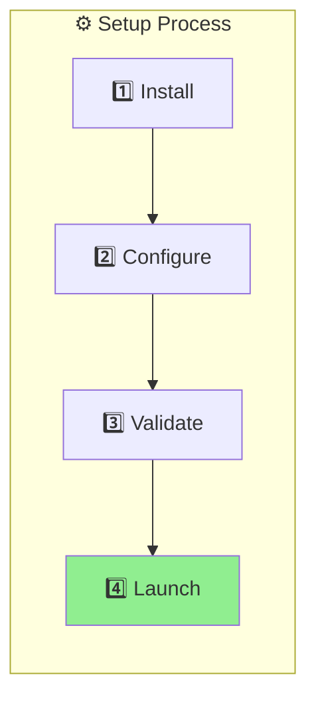

---

### 1️⃣ Prerequisites

| Requirement | Description |
|:------------|:------------|
| 🐍 **Python 3.9+** | Installed and added to PATH |
| 📦 **Git** | For cloning the repository |
| 🏦 **Broker Account** | Alpaca (Paper/Live) and/or Tastytrade |

---

### 2️⃣ Installation

Clone the repository and run the automated setup script:

```powershell
# Clone the repository
git clone <repository-url>
cd Bot

# Run the automated setup script (Windows)
.\setup_environment.bat
```

> 💡 *For Linux/Mac, use `./setup_environment.sh`*

---

### 3️⃣ Configuration

The bot uses a **CLI-based configuration system** with TOML files:

```powershell
# Initialize configuration (creates .secrets.toml from template)
python -m src.config.cli init

# Edit your credentials
# Open: config/.secrets.toml

# Validate your configuration
python -m src.config.cli validate
```

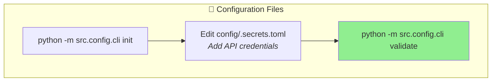

> 📖 See **[Configuration Guide](docs/CONFIGURATION.md)** for detailed setup instructions.

---

### 4️⃣ Launch 🚀

For the bot to receive signals from TradingView, **ngrok must be running first**.

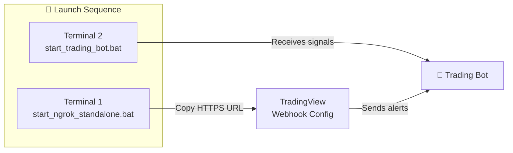

| Step | Command | Description |
|:----:|:--------|:------------|
| 1️⃣ | `.\start_ngrok_standalone.bat` | Start tunnel (keep window open) |
| 2️⃣ | Copy the HTTPS URL | e.g., `https://xyz.ngrok-free.app` |
| 3️⃣ | `.\start_trading_bot.bat` | Start bot in **new terminal** |

---

### 5️⃣ Stopping the Bot 🛑

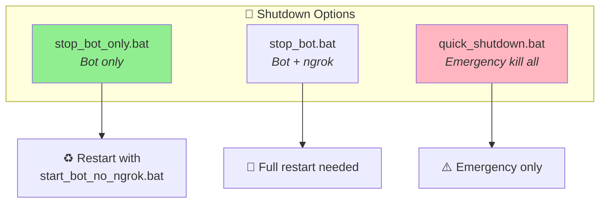

| Script | Stops | Use Case |
|:-------|:------|:---------|
| `stop_bot_only.bat` | Bot only | ♻️ Restart without losing ngrok URL |
| `stop_bot.bat` | Bot + ngrok | 🔄 Full shutdown |
| `quick_shutdown.bat` | Everything | ⚠️ Emergency stop |

**Recommended workflow:**
```powershell
.\stop_bot_only.bat        # Stop bot, keep tunnel
.\start_bot_no_ngrok.bat   # Restart bot
```

---

## 🌟 Key Features

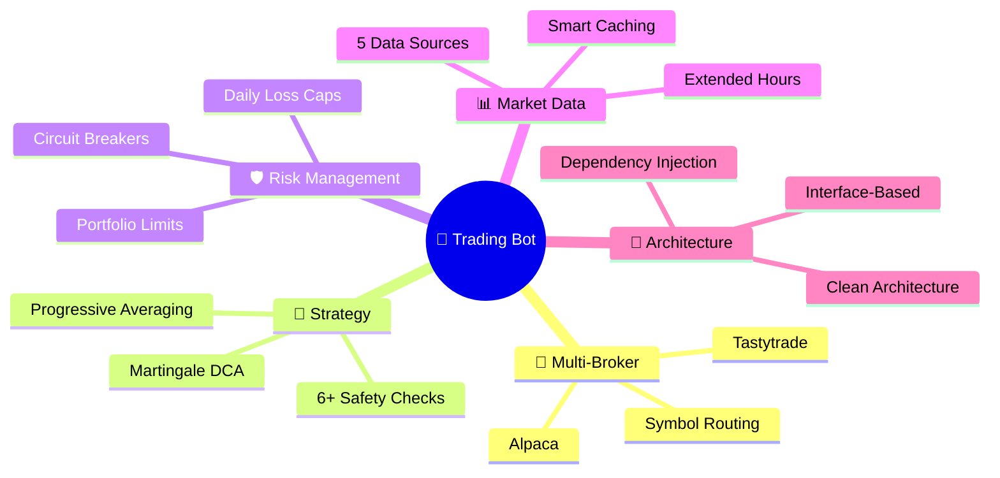

---

### 🔄 Multi-Broker Support

Trade on **Alpaca** and **Tastytrade** simultaneously with intelligent symbol routing:

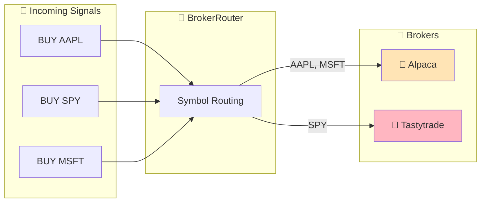

---

### 🧠 Martingale DCA Strategy

Intelligent position averaging with **6+ safety mechanisms**:

| Safety Check | Description |
|:-------------|:------------|
| 🔢 **Max Attempts Cap** | Hard limit on averaging attempts (default: 3-4) |
| 💰 **Position Size Limits** | Maximum % of portfolio per position |
| 📉 **Price Improvement** | Each DCA must be at a better price |
| 🛑 **Daily Loss Limit** | Auto-stop when daily loss threshold hit |
| ⚖️ **Portfolio Exposure** | Caps on total market exposure |
| 🔌 **Circuit Breakers** | Auto-shutdown on critical failures |

---

### 📊 Broker-Specific Market Data

Each broker uses **its own dedicated market data provider** for consistency:

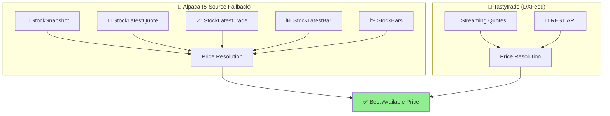

| Broker | Data Sources | Extended Hours |
|:-------|:-------------|:---------------|
| **Alpaca** | 5 endpoints with smart fallback | ✅ Pre-market & After-hours |
| **Tastytrade** | DXFeed streaming + REST | ✅ Pre-market & After-hours |

---

## 🏗️ Architecture

The bot follows **Clean Architecture** principles with strict separation of concerns:

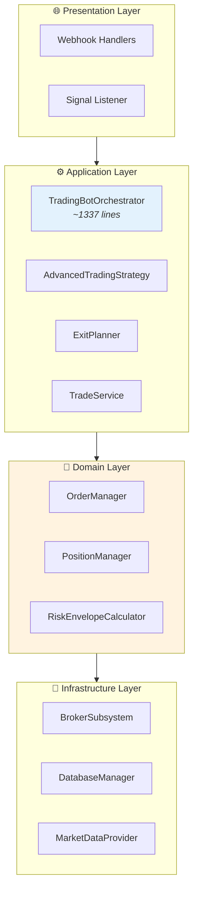

---

### 🎯 Core Services

| Service | File | Responsibility |
|:--------|:-----|:---------------|
| **TradingBotOrchestrator** | `src/trading_bot.py` | Composition root (~1337 lines) |
| **BrokerSubsystem** | `src/broker/subsystem.py` | Multi-broker abstraction |
| **OrderManager** | `src/trading/order_manager.py` | Order lifecycle & fill tracking |
| **PositionManager** | `src/position/position_manager.py` | Position tracking & reconciliation |
| **RiskEnvelopeCalculator** | `src/risk/risk_envelope_calculator.py` | Risk validation & portfolio limits |
| **AdvancedTradingStrategy** | `src/strategies/advanced_strategy.py` | DCA with progressive averaging |

---

### 🔧 Extracted Services (Clean Code)

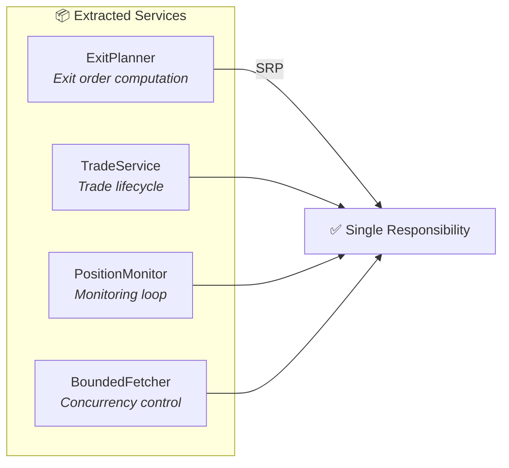

| Service | File | Purpose |
|:--------|:-----|:--------|
| **ExitPlanner** | `src/trading/exit_planner.py` | Centralized exit logic |
| **TradeService** | `src/trading/trade_service.py` | Trade completion & audit |
| **PositionMonitor** | `src/trading/position_monitor.py` | Parallel price fetching |
| **BoundedFetcher** | `src/utils/bounded_gather.py` | API rate limiting |

---

### 🎨 Design Patterns

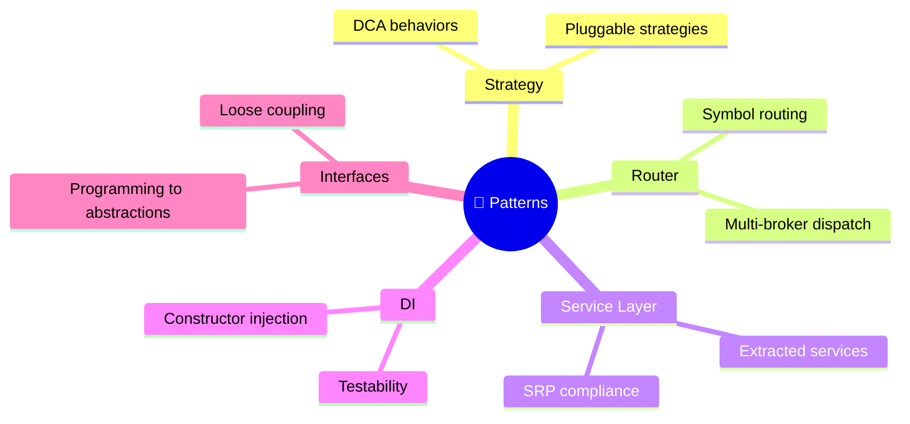

---

## 📊 How It Works

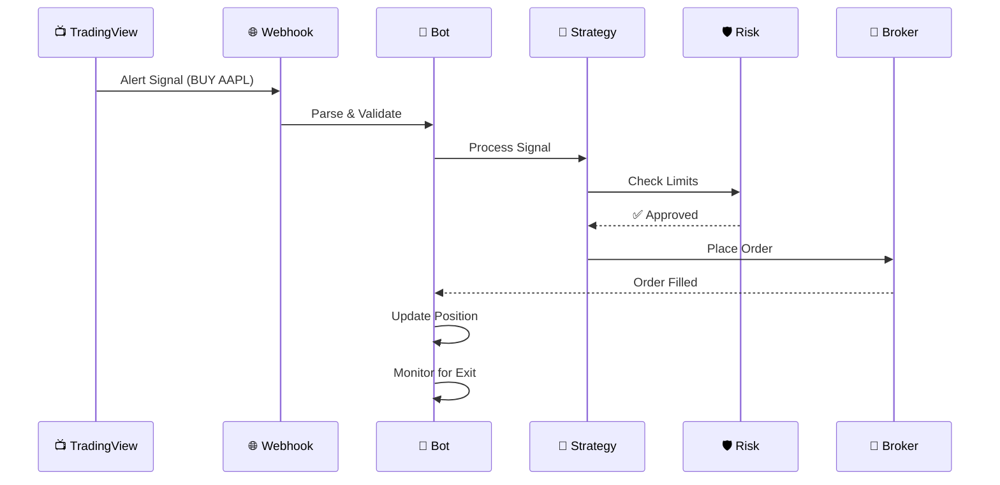

---

## 📚 Documentation

| Document | Description |
|:---------|:------------|
| 📖 **[User Guide](docs/USER_GUIDE.md)** | Complete manual for configuration & usage |
| ⚙️ **[Configuration Guide](docs/CONFIGURATION.md)** | TOML config system & CLI commands |
| 🍒 **[Tastytrade Setup](docs/TASTYTRADE_SETUP.md)** | OAuth setup for Tastytrade |
| 🧠 **[Martingale Safety](docs/MARTINGALE_SAFETY_SUMMARY.md)** | Strategy math & safety mechanisms |
| 🔌 **[Adapters Index](docs/ADAPTERS_INDEX.md)** | External integrations reference |

---

## ⚠️ Disclaimer

<div align="center">

### ⚠️ **USE AT YOUR OWN RISK** ⚠️

</div>

This software is for **educational and research purposes only**. Algorithmic trading involves substantial risk of financial loss.

| ⚠️ Warning | Description |
|:-----------|:------------|
| 📉 **Risk of Loss** | Past performance does not guarantee future results |
| 🧪 **Test First** | Always use Paper Trading before real funds |
| 🎰 **Martingale Risk** | Strategy carries specific risks (see docs) |
| 📜 **No Liability** | Authors assume no responsibility for losses |

---

<div align="center">

**Built with ❤️ for algorithmic traders**

[](https://python.org)
[](docs/ADAPTERS_INDEX.md)
[](LICENSE)

</div>
