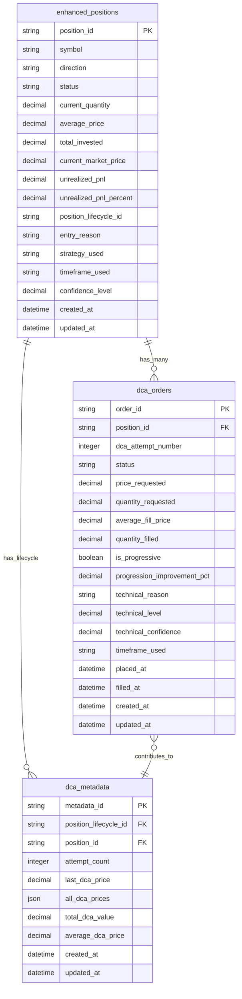
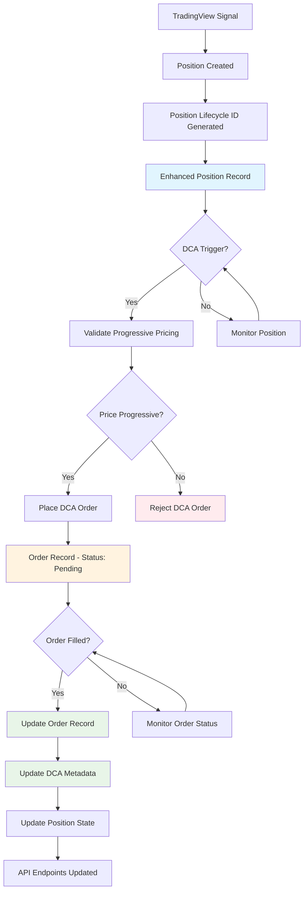
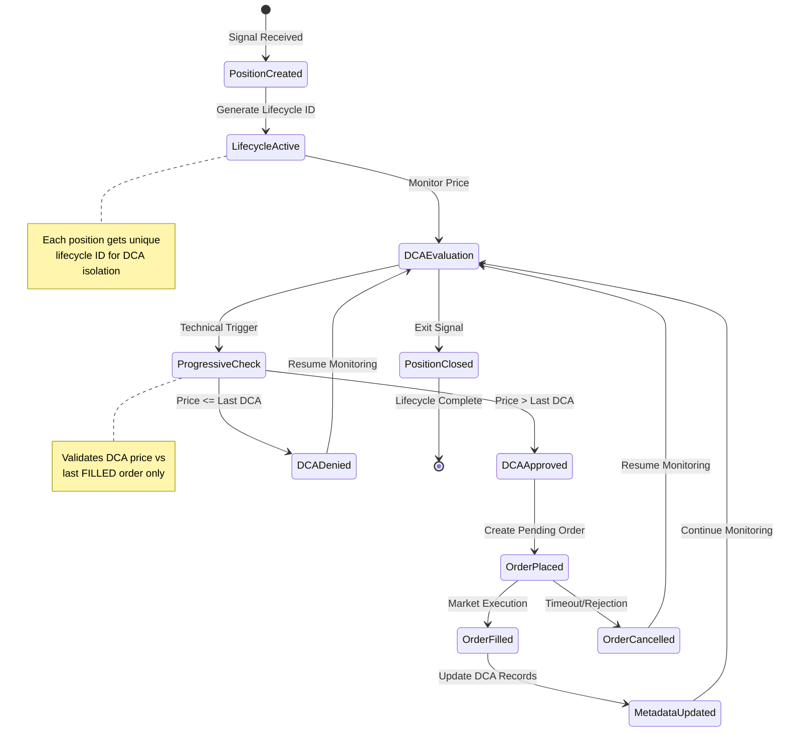
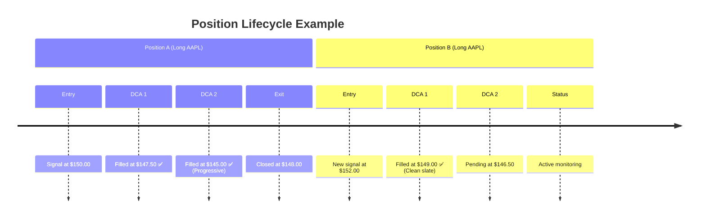
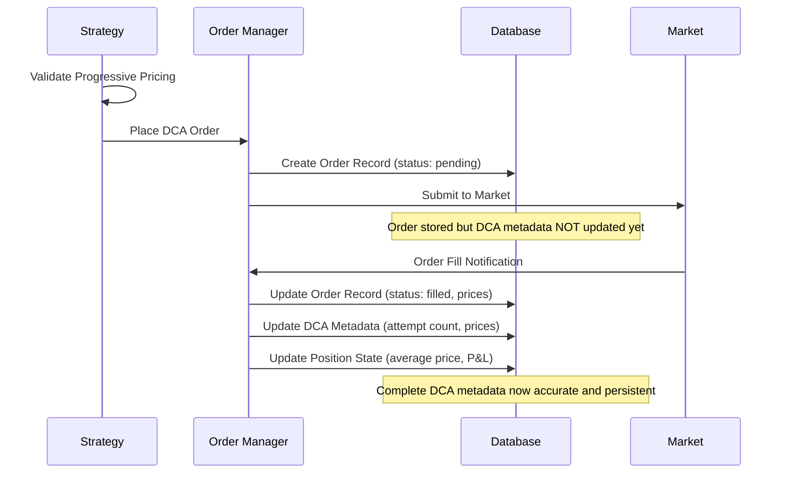

# 🤖 Advanced Trading Bot with Technical Analysis DCA

[]()
[]()
[]()
[]()

A sophisticated algorithmic trading bot that processes TradingView webhook signals and executes trades through the Alpaca API. Features **revolutionary technical analysis-based DCA strategy** that eliminates arbitrary loss thresholds in favor of pure market structure analysis.

## 🚀 Key Features

### 🧠 **Enhanced DCA Strategy** (Revolutionary Approach)
- **❌ No More Arbitrary Loss Thresholds**: Eliminates the flawed "2% loss = DCA" approach
- **📊 Pure Technical Analysis**: DCA triggers only on actual support/resistance breaches
- **⏰ Timeframe Consistency**: Uses original signal timeframe for all DCA decisions
- **🎯 Market Structure Aware**: Respects chart patterns, pivot points, and volume profiles
- **📈 Dual Direction Support**: Works for both long positions (support) and short positions (resistance)

### 🔧 **Core Trading Features**
- **TradingView Integration**: Webhook endpoints for receiving trading signals
- **Advanced Position Management**: Long/short positions with trailing stops
- **Institutional-Grade Order Management**: Real-time monitoring and fill tracking
- **Risk Management**: Position sizing, validation, and protection
- **Trade Audit System**: Complete lifecycle tracking with precision pricing
- **Performance Analytics**: Real-time P&L with actual fill prices and win rates

### 📊 **Monitoring & Analytics**
- **Web Dashboard**: Real-time position and trade monitoring
- **Comprehensive Logging**: Detailed execution and decision tracking
- **Non-blocking Architecture**: Concurrent webhook processing for high throughput

### 💹 **Enhanced Market Data & Price Fetching System**
- **5-Source Intelligent Prioritization**: Advanced Snapshot → Trade → Quote → Latest Bar → Recent Bars hierarchy
- **Aggressive Freshness Optimization**: Dynamic source switching for optimal data recency
- **Extended Hours Intelligence**: Pre/post market data with adaptive weighting algorithms
- **Stale Data Protection**: Automated warnings and source switching for aged data (>1 hour)
- **Multi-Exchange Support**: IEX (free tier) and SIP (premium) data feed compatibility
## 🎯 Recommended: Get Free ngrok Token (Easiest)
- Most reliable and stable
- Takes only 2 minutes to set up
```bash
python setup_ngrok_auth.py
```

#### 🌩️ Alternative: Cloudflare Tunnel (No Signup)
- Zero signup required, completely free forever
```bash
python setup_alternative_tunnels.py
# Choose option 1 (Cloudflare)
```

#### 🌐 Alternative: localtunnel (Requires Node.js)
```bash
python setup_alternative_tunnels.py  
# Choose option 2 (localtunnel)
```

## 🧪 Testing

### Running the Test Suite

```bash
# Run all tests
python -m pytest

# Run specific test categories
python -m pytest tests/unit/
python -m pytest tests/integration/
python -m pytest tests/test_webhook_concurrency.py

# Run with verbose output
python -m pytest -v

# Run with coverage
python -m pytest --cov=src
```

### Webhook Testing

#### Manual Testing
```bash
# Test webhook concurrency
python tests/test_webhook_concurrency.py https://your-ngrok-url.ngrok-free.app/webhook

# PowerShell webhook test
$payload = '{"symbol":"AAPL","action":"buy","price":150.0,"quantity":100}'
Invoke-RestMethod -Uri "https://your-ngrok-url.ngrok-free.app/webhook" -Method POST -Headers @{"Content-Type"="application/json"} -Body $payload
```

#### Automated Testing
```bash
# Run webhook-specific tests
python -m pytest tests/test_webhook_concurrency.py -v
python -m pytest tests/test_webhook_handler_async.py -v
```

### Test Categories

1. **Unit Tests** (`tests/unit/`)
   - Individual component testing
   - Mock-based isolated testing
   - Business logic validation

2. **Integration Tests** (`tests/integration/`)
   - End-to-end workflow testing
   - API integration testing
   - Database integration testing

3. **Webhook Tests** (`tests/test_webhook_*.py`)
   - Concurrency testing
   - Non-blocking behavior verification
   - Error handling validation

4. **Strategy Tests** (`tests/test_*strategy*.py`)
   - Trading strategy validation
   - Position management testing
   - Risk management verification

## 🚨 Recent Webhook Fix (Critical Update)

### Issue Resolved
Fixed critical webhook blocking issue where multiple rapid requests would cause the system to hang.

### Problem
- First webhook request processed but took 7+ seconds due to order retry logic
- Subsequent requests would hang indefinitely
- No activity recorded for follow-up requests

### Solution Implemented

#### 1. Non-blocking Webhook Handler
**File**: `src/signals/signal_listener.py`

**Before**:
```python
if self._signal_callback:
    await self._call_callback_safely(signal)  # BLOCKING!
```

**After**:
```python
if self._signal_callback:
    # Fire-and-forget execution - immediate response
    asyncio.create_task(self._call_callback_safely(signal))
```

#### 2. Improved Error Classification
**File**: `src/trading/order_manager.py`

- Enhanced detection of non-retryable errors (e.g., "cannot be sold short")
- Added Alpaca-specific error code handling (42210000)
- Prevented unnecessary retries for permanent business logic errors

### Testing the Fix

```bash
# Verify webhook responsiveness
python tests/test_webhook_concurrency.py

# Expected results:
# ✅ All responses < 2 seconds
# ✅ Multiple concurrent requests work
# ✅ Signal processing continues in background
```

### Performance Impact
- **Before**: 7+ seconds per webhook, blocking subsequent requests
- **After**: < 1 second per webhook, unlimited concurrent handling

## 📊 Monitoring

### Enhanced Monitoring Endpoints

The bot provides comprehensive monitoring through multiple API endpoints that are automatically displayed when the bot starts:

```
📊 BOT MONITORING ENDPOINTS AVAILABLE
🏠 Health Check:     http://localhost:8080/health
📈 Positions:        http://localhost:8080/positions
📊 Bot Status:       http://localhost:8080/status
🎯 Strategy Details: http://localhost:8080/strategy
📋 Recent Orders:    http://localhost:8080/orders
💰 Trading Summary:  http://localhost:8080/trades
```

#### `/health` - Health Check
Basic health status and system availability:
```bash
curl http://localhost:8080/health
# Returns: {"status": "healthy", "timestamp": "..."}
```

#### `/positions` - Active Positions
Real-time position data with P&L:
```bash
curl http://localhost:8080/positions
# Returns detailed position information including:
# - Symbol, quantity, average price
# - Current price and unrealized P&L
# - Entry time and duration
```

#### `/status` - Bot Status
Comprehensive bot status including:
```bash
curl http://localhost:8080/status
# Returns:
# - System status and uptime
# - Active positions count
# - Recent trading activity
# - Risk management metrics
```

#### `/strategy` - Strategy Details
**NEW**: Detailed strategy monitoring for trailing and averaging:
```bash
curl http://localhost:8080/strategy
# Returns for each position:
# - Current strategy phase (entry, trailing, averaging)
# - Trailing stop levels and profit targets
# - Averaging attempts and thresholds
# - Risk management status
```

#### `/orders` - Order History
Recent order activity and execution status:
```bash
curl http://localhost:8080/orders
# Returns recent orders with execution details
```

#### `/trades` - Trading Performance & Analytics
Comprehensive trading summary with performance metrics:
```bash
curl http://localhost:8080/trades
# Returns:
# - Open trades with entry details
# - Recent completed trades with accurate P&L
# - Performance analytics (win rate, profit factor, etc.)
# - Trade audit trail with actual fill prices
```

**Key Features:**
- **Accurate P&L Tracking**: Uses actual fill prices, not order prices
- **Complete Trade Lifecycle**: Entry to exit with timestamps and reasons
- **Performance Metrics**: Win rate, average profit/loss, profit factor
- **Trade History**: Recent completed trades with detailed execution data
- **Real-time Analytics**: Updated with each trade completion

### Position Persistence & Recovery

**NEW FEATURE**: Positions are now fully persistent across bot restarts.

#### How It Works
1. **Database Storage**: All position changes are saved to `trading_bot.db`
2. **Automatic Recovery**: On startup, the bot restores all active positions
3. **Seamless Resume**: Trailing stops and averaging strategies resume automatically

#### Startup Position Recovery
When the bot starts, you'll see:
```
🔄 RESTORED 2 POSITIONS FROM DATABASE:
   AAPL: long 150 @ 148.50
   TSLA: short 50 @ 245.75
```

#### Position Lifecycle Logging
**Enhanced Logging**: The bot now provides verbose feedback on all position activities:

```
🟢 NEW POSITION: AAPL long 100 @ 150.00
🎯 TRAILING STARTED: AAPL LONG @ 152.30
   📊 Profit: 3.2% | Threshold: 3.0%
   🛡️ Trail distance: 1.5% | Initial trail: 150.01
🏔️ NEW PEAK: AAPL 152.30 → 154.20 | Trail: 151.89
📉 LOSS DETECTED: AAPL -2.1% ≤ -2.0%
📈 AVERAGING DOWN: AAPL +150 @ 147.50
   💰 New average price: 148.75 | Total quantity: 250
   🔄 Attempt 1/3
🛑 TRAILING STOP HIT: AAPL 151.50 ≤ 151.89
🔴 POSITION CLOSED: AAPL long 250 @ 151.50
   📊 Final P&L: 1.85% | Averaging attempts: 1
```

### Log Files
- `logs/trading_bot.log` - Main application logs with enhanced position tracking
- `logs/error.log` - Error-specific logs
- `logs/webhook.log` - Webhook request logs

### Health Monitoring
```bash
# Check bot status
curl http://localhost:8080/health

# Monitor positions in real-time
curl http://localhost:8080/positions

# Check strategy details
curl http://localhost:8080/strategy

# Monitor logs in real-time
tail -f logs/trading_bot.log
```

### Performance Metrics
- Webhook response times (should be < 1 second)
- Order placement success rates
- Signal processing throughput
- Error rates and retry patterns
- Position persistence and recovery success

## 📊 Trade Audit & Analytics System

### Overview
The bot implements institutional-grade trade tracking with precise fill price capture and comprehensive audit trails. Every trade is monitored from placement through completion, ensuring accurate performance analytics and regulatory compliance.

### Key Capabilities

#### 🎯 Precise Fill Price Capture
- **Continuous Monitoring**: Orders monitored every 10 seconds until filled or cancelled
- **Actual Execution Prices**: Records real fill prices from broker, not order placement prices
- **Slippage Detection**: Identifies and reports price differences between order and execution
- **Market Hours Agnostic**: Works seamlessly during regular, pre-market, and after-hours trading

#### 📋 Complete Order Lifecycle Tracking
- **Order Placement**: Records order submission with retry logic and error handling
- **Fill Detection**: Real-time monitoring captures exact fill times and prices
- **Status Updates**: Tracks order progression from pending to filled or cancelled
- **Trade Completion**: Links entry and exit orders for complete trade correlation

#### 📋 Complete Trade Lifecycle Management
- **Entry Tracking**: Records opening trades with strategy, price, and quantity
- **Exit Documentation**: Captures closing trades with reason (profit, stop-loss, manual)
- **Trade Correlation**: Links entry and exit orders for complete trade picture
- **Strategy Attribution**: Associates trades with specific strategy configurations

#### 📈 Performance Analytics Engine
- **Win Rate Analysis**: Calculates winning vs losing trade percentages
- **Profit Factor**: Measures ratio of average wins to average losses
- **Trade Duration**: Tracks holding periods for optimization
- **Realized P&L**: Accurate profit/loss calculations using actual fill prices

### Database Schema
The system uses SQLite with two core tables:

#### TradeRecord Table
```sql
- trade_id: Unique identifier for each trade
- symbol: Stock symbol
- entry_order_id: Opening order reference
- entry_price: Actual fill price (not order price)
- entry_quantity: Shares traded
- entry_time: Precise fill timestamp
- exit_order_id: Closing order reference
- exit_price: Actual exit fill price
- realized_pnl: Calculated profit/loss
- strategy_used: Strategy configuration
```

#### PositionTrackingRecord Table
```sql
- symbol: Stock symbol
- total_quantity: Current position size
- avg_entry_price: Average cost basis
- trailing_data: Stop-loss tracking
- cost_basis: Total investment
```

### Web Interface Integration
Access comprehensive trade data through REST endpoints:

- **`/trades`**: Complete trading summary with analytics
- **`/positions`**: Current positions with unrealized P&L
- **`/status`**: Real-time bot performance metrics

### Configuration
Enhanced trailing profit configuration with precise control:

```yaml
trading:
  risk_management:
    profit_taking:
      trailing_profit:
        acceleration_factor: 1.5  # Rate of trailing stop tightening
        profit_steps: 2          # Steps for profit taking
```

### Benefits
- **Regulatory Compliance**: Complete audit trail for tax reporting
- **Performance Optimization**: Data-driven strategy refinement
- **Risk Management**: Real-time P&L monitoring and limits
- **Debugging Support**: Detailed execution logs for troubleshooting
- **Portfolio Analysis**: Historical performance tracking

## 💹 Enhanced Market Data & Price Fetching System

### 🎯 Intelligent Multi-Source Architecture

The trading bot employs a **sophisticated 5-source data prioritization system** designed for maximum reliability, freshness, and market condition adaptability. This system eliminates the common issue of stale price data affecting trading decisions.

#### **Core Design Philosophy**
- **Reliability First**: Prioritize proven data sources during market hours
- **Freshness Override**: Aggressively switch to significantly fresher data when available
- **Market Awareness**: Adapt data selection based on market sessions (regular/extended/closed)
- **Stale Data Protection**: Prevent trading decisions based on severely outdated pricing

#### **📊 5-Source Priority Hierarchy**

```python
# ENHANCED PRIORITY SYSTEM WITH ADAPTIVE SELECTION
Priority 1: SNAPSHOT API     # Most reliable during market hours
Priority 2: LATEST TRADE     # Actual execution data (real transactions)  
Priority 3: LATEST QUOTE     # Bid/ask spread data (market sentiment)
Priority 4: LATEST BAR       # 1-minute OHLCV candle data
Priority 5: RECENT BARS      # Historical data fallback (emergency only)
```

**Key Enhancement**: The system **collects data from ALL sources simultaneously** and applies intelligent selection logic rather than stopping at the first available source.

#### **🚀 Aggressive Freshness Optimization**

Unlike traditional systems that blindly follow priority order, our enhanced algorithm implements **adaptive freshness override** based on data staleness:

```python
# DYNAMIC FRESHNESS THRESHOLDS
if best_candidate_age > 1_hour:
    switch_threshold = 10_seconds    # Aggressive: Any fresher data wins
elif best_candidate_age > 5_minutes:
    switch_threshold = 30_seconds    # Moderate: 30s improvement required
elif best_candidate_age < 5_minutes:
    switch_threshold = 15_seconds    # Conservative: 15s improvement required
```

**Real-World Impact**: 
- ✅ **Prevents 40,000+ second old data selection** (original issue)
- ✅ **Automatically switches to fresher sources** when priority data is stale
- ✅ **Warns operators** when forced to use aged data during market closures

#### **⏰ Market Session Intelligence**

The system adapts its behavior based on current market conditions:

##### **Regular Market Hours (9:30 AM - 4:00 PM ET)**
- **Optimal Performance**: All data sources typically fresh (seconds old)
- **Priority Respected**: Snapshot API preferred for maximum reliability
- **Quality Assurance**: Data age typically <60 seconds across all sources

##### **Extended Hours (Pre: 4:00-9:30 AM, Post: 4:00-8:00 PM ET)**
- **Enhanced Bar Weighting**: Latest bars receive 20% age reduction in calculations
- **Source Adaptation**: Automatically adjusts to limited IEX data coverage
- **Intelligence Logging**: Detailed extended hours data quality reporting

##### **Market Closed (Weekends/Holidays)**
- **Stale Data Warnings**: Automatic alerts when data exceeds acceptable age thresholds
- **Best Available Selection**: Prioritizes least stale option among available sources
- **Context Awareness**: Logs market closure context to prevent false alerts

#### **🔍 Enhanced Transparency & Monitoring**

**Comprehensive Selection Logging**:
```bash
# Example Output During Selection Process
📊 All candidates: 👑P1:snapshot_api(2.5hr) | P2:latest_trade(45min) | P3:latest_quote(15min)
🚀 FRESHNESS OVERRIDE (stale data override): latest_quote is 2.3hr fresher, switching from snapshot_api
🏆 SELECTED: LATEST_QUOTE (Priority 3: Quote) - $231.57 (age: 15min)
⚠️ Extended hours note: IEX limited coverage - upgrade to SIP for full data
```

**Data Quality Metrics**:
- **Candidate Analysis**: Shows all available sources with precise ages
- **Selection Reasoning**: Explains why specific source was chosen
- **Freshness Analysis**: Quantifies improvement when switching sources
- **Market Context**: Provides session-aware quality assessments

#### **⚙️ Advanced Configuration Options**

```yaml
# Enhanced Market Data Configuration
data:
  alpaca:
    # Source enablement
    use_snapshot: true              # Priority 1 - Market hours reliability
    fallback_to_bars: true          # Priority 4-5 - Extended hours support
    extended_hours: true            # Pre/post market intelligence
    
    # Timeout settings (reliability optimization)
    snapshot_timeout: 10            # Fast timeout for high-priority data
    quote_timeout: 10               # Balanced timeout for quote data  
    bars_timeout: 15               # Extended timeout for complex queries
    
    # Freshness optimization
    cache_duration: 30              # Seconds to cache successful requests
    max_retries: 3                  # API failure retry attempts
    
    # Advanced selection logic
    extended_hours_age_discount: 0.8  # 20% age reduction for bars during extended hours
```

#### **🛡️ Error Handling & Resilience**

**Graceful Degradation**:
- **Source Failures**: Automatic fallback through complete priority cascade
- **Timeout Protection**: Per-source timeout prevents system lockup
- **Retry Logic**: Exponential backoff for transient API failures
- **Circuit Breaker**: Prevents excessive API calls during outages

**Data Validation**:
- **Negative Timestamp Handling**: Proper processing of future-dated market data
- **Price Sanity Checks**: Validation against reasonable price ranges
- **Age Calculation**: Timezone-aware timestamp processing for accuracy

#### **📈 Performance Optimizations**

**Parallel Processing**:
```python
# All sources queried simultaneously for minimum latency
async with asyncio.gather(
    get_snapshot_price(symbol),
    get_latest_trade_price(symbol), 
    get_latest_quote_price(symbol),
    get_latest_bar_price(symbol)
) as results:
    select_optimal_candidate(results)
```

**Intelligent Caching**:
- **30-second cache duration** prevents excessive API calls
- **Symbol-specific caching** ensures fresh data per trading instrument
- **Cache invalidation** during high-volatility periods

#### **🔧 Troubleshooting & Diagnostics**

**Common Scenarios**:

1. **"Why is 11-hour old data being selected?"**
   - **Cause**: Market closed, all sources stale
   - **Solution**: System now warns and selects least stale option
   - **Prevention**: Enhanced freshness override prevents this during market hours

2. **"Extended hours pricing seems inaccurate"**
   - **Cause**: Free tier IEX limited to ~3% market volume
   - **Solution**: Upgrade to SIP data plan for full extended hours coverage
   - **Mitigation**: System logs data quality warnings automatically

3. **"Price updates are too slow"**
   - **Cause**: API timeouts or network latency
   - **Solution**: Adjust timeout settings in configuration
   - **Optimization**: Parallel source querying minimizes total response time

### Integration with Trading Strategy

The enhanced market data system directly supports the bot's **technical analysis-based DCA strategy**:

- **Real-time Support/Resistance**: Fresh pricing enables accurate technical level calculations
- **Position Management**: Precise entry/exit pricing for optimal P&L tracking  
- **Risk Management**: Stale data warnings prevent decisions based on outdated market conditions
- **Extended Hours Trading**: Comprehensive pre/post market data for 24/7 opportunity capture

This market data foundation ensures that all trading decisions are based on the most current, reliable pricing available across multiple data sources and market conditions.

## ⚙️ Configuration

### Main Configuration (`config.yaml`)

```yaml
# Trading Configuration
trading:
  order_type: "limit"  # market, limit, stop, stop_limit
  position_sizing:
    method: "percentage"  # fixed, percentage, risk_based
    percentage: 1.0       # 1% of buying power
  
# Webhook Configuration
api:
  webhook:
    host: "0.0.0.0"
    port: 8080
    security_enabled: true
    secret: "your-webhook-secret"

# Strategy Configuration
strategies:
  long_strategy:
    enabled: true
    profit_target: 0.05          # 5%
    trailing_enabled: true
    trailing_percentage: 0.015   # 1.5%
    
  short_strategy:
    enabled: true
    profit_target: 0.05
    trailing_enabled: true
    trailing_percentage: 0.015

# Risk Management
risk:
  max_position_size: 10000     # Maximum position size in USD
  max_daily_loss: 500          # Maximum daily loss in USD
  max_open_positions: 5        # Maximum concurrent positions
```

### Environment Variables

```bash
# Required
ALPACA_API_KEY=your-api-key
ALPACA_SECRET_KEY=your-secret-key
ALPACA_BASE_URL=https://paper-api.alpaca.markets

# Optional
TRADING_BOT_NO_NGROK=true     # Disable ngrok
WEBHOOK_SECRET=your-secret     # Webhook authentication
LOG_LEVEL=INFO                 # Logging level
```

## 🏗️ Technical Architecture

### System Overview

The trading bot follows a clean, modular architecture based on SOLID principles:

```
┌─────────────────────────────────────────────────────────────────┐
│                     Trading Bot System                          │
├─────────────────────────────────────────────────────────────────┤
│  ┌─────────────────┐    ┌─────────────────┐    ┌──────────────┐ │
│  │   Web Hook      │    │   Signal        │    │  Trade       │ │
│  │   Listener      │───▶│   Processor     │───▶│  Executor    │ │
│  │   (Flask/FastAPI)│    │                 │    │              │ │
│  └─────────────────┘    └─────────────────┘    └──────────────┘ │
│           │                       │                       │      │
│           ▼                       ▼                       ▼      │
│  ┌─────────────────┐    ┌─────────────────┐    ┌──────────────┐ │
│  │   Configuration │    │   Risk & Position│    │  Alpaca API  │ │
│  │   Manager       │    │   Manager       │    │  Client      │ │
│  └─────────────────┘    └─────────────────┘    └──────────────┘ │
│           │                       │                       │      │
│           ▼                       ▼                       ▼      │
│  ┌─────────────────┐    ┌─────────────────┐    ┌──────────────┐ │
│  │   Logging &     │    │   Support Level │    │  Trailing    │ │
│  │   Monitoring    │    │   Calculator    │    │  Profit Mgr  │ │
│  └─────────────────┘    └─────────────────┘    └──────────────┘ │
└─────────────────────────────────────────────────────────────────┘
```

### Key Components

#### 1. Signal Processing Layer
- **WebhookListener**: Receives TradingView webhook signals
- **SignalProcessor**: Validates and processes incoming signals
- **SignalValidator**: Ensures signal integrity and format

#### 2. Trading Execution Layer
- **OrderManager**: Manages order lifecycle (create, modify, cancel)
- **AlpacaClient**: Wrapper for Alpaca API interactions
- **TradeExecutor**: Executes trading strategies based on signals

#### 3. Risk & Position Management
- **PositionManager**: Tracks current positions and exposure
- **RiskManager**: Enforces position sizing and risk limits
- **SupportCalculator**: Calculates support levels for averaging down

#### 4. Profit Management
- **TrailingProfitManager**: Implements trailing profit logic
- **ProfitCalculator**: Calculates profit/loss metrics
- **ExitStrategy**: Manages position exit conditions

#### 5. Configuration & Infrastructure
- **ConfigurationManager**: Handles all configuration settings
- **Logger**: Centralized logging system
- **DatabaseManager**: Handles trade history and state persistence

### Design Principles Applied

#### Single Responsibility Principle (SRP)
Each class has one clear responsibility:
- `OrderManager` only handles order operations
- `SupportCalculator` only calculates support levels
- `TrailingProfitManager` only manages trailing profit logic

#### Open/Closed Principle (OCP)
- Abstract base classes for extensibility
- Strategy pattern for different calculation methods
- Plugin architecture for new signal sources

#### Liskov Substitution Principle (LSP)
- All implementations can be substituted without breaking functionality
- Common interfaces for different API providers

#### Interface Segregation Principle (ISP)
- Small, focused interfaces
- Clients depend only on methods they use

#### Dependency Inversion Principle (DIP)
- High-level modules depend on abstractions
- Dependency injection for all external dependencies

### Technology Stack
- **Language**: Python 3.9+
- **Web Framework**: FastAPI (for webhook endpoints)
- **API Client**: Alpaca-py
- **Configuration**: YAML/JSON
- **Testing**: pytest
- **Logging**: Python logging with structured output
- **Database**: SQLite (development) / PostgreSQL (production)

### Scalability Considerations
- Asynchronous processing for webhook handling
- Queue-based architecture for high-frequency signals
- Stateless design for horizontal scaling
- Configurable retry mechanisms with exponential backoff
- Circuit breaker pattern for API failures

### Order Management System

The bot implements institutional-grade order execution with comprehensive fill price tracking and continuous monitoring.

#### Core Order Processing
- **Asynchronous Execution**: Non-blocking order placement with concurrent processing
- **Retry Logic**: Automatic retry with exponential backoff for transient failures
- **Extended Hours Support**: Pre-market and after-hours trading capabilities
- **Multiple Order Types**: Market, limit, and stop orders with proper time-in-force handling

#### Fill Price Accuracy System

The order management system ensures precise fill price capture for accurate P&L calculations:

**Continuous Order Monitoring**
```python
# Orders are monitored continuously during bot cycles
pending_orders = await order_manager.get_pending_market_orders()
newly_filled = await order_manager.check_and_update_fills()

# Real-time fill price capture
for order in newly_filled:
    actual_price = order.filled_price  # Actual execution price from broker
    logger.info(f"Order filled: {order.symbol} @ ${actual_price:.4f}")
```

**Key Benefits**:
- **Price Accuracy**: Uses actual fill prices, not order placement prices
- **Market Hours Agnostic**: Works during regular, pre-market, and after-hours trading
- **Slippage Detection**: Identifies and logs price differences between order and fill
- **Strategy Integration**: Updates strategy positions with actual execution prices

#### Order Lifecycle Management

**1. Order Placement**
- Validates order parameters (symbol, quantity, price)
- Converts to Alpaca API format with extended hours flags
- Submits order with retry logic for transient failures
- Stores in active orders collection for monitoring

**2. Fill Monitoring**
- Continuous status checking every 10 seconds during bot cycles
- Refreshes order data from broker to capture fill information
- Logs fill price capture with detailed slippage analysis
- Updates strategy positions with actual execution prices

**3. Order Completion**
- Moves filled orders to history with complete audit trail
- Triggers trade completion logic for database recording
- Updates position management with actual fill data
- Generates performance analytics using real execution prices

#### Error Handling & Resilience

**Non-Retryable Errors**
- Insufficient buying power
- Invalid symbols or market restrictions
- Position size violations
- Market closure restrictions

**Retryable Errors**
- Network timeouts
- API rate limits
- Temporary broker unavailability
- Transient system errors

#### Extended Hours Trading

The system supports comprehensive extended hours trading:

**Configuration**
```yaml
extended_hours:
  enabled: true
  pre_market:
    enabled: true    # 4:00 AM - 9:30 AM ET
  after_hours:
    enabled: true    # 4:00 PM - 8:00 PM ET
```

**Implementation Features**:
- Sets `extended_hours=true` flag on Alpaca orders when enabled
- 24-hour order monitoring duration (covers full pre/post market)
- Continuous fill detection regardless of market hours
- Automatic order timeout after 24 hours if unfilled

### Strategy Position Management

The bot maintains precise position tracking with actual fill price integration:

**Position Updates**
- Real-time position synchronization with broker
- Accurate average price calculations using fill prices
- Trailing stop adjustments based on actual entry prices
- Complete trade lifecycle correlation

**Zombie Position Prevention**
- Automatic position reconciliation with broker
- Trade completion logic for externally closed positions
- Maintains audit trail even for manual interventions
- Ensures all trades appear in performance analytics

### Performance & Monitoring

**Real-time Metrics**
- Order fill rate and timing analysis
- Price slippage tracking and reporting
- Strategy performance with actual execution prices
- System health and error rate monitoring

**Logging & Audit Trail**
- Comprehensive order lifecycle logging
- Fill price capture confirmation logs
- Strategy decision audit trails
- Complete regulatory compliance records

## 🔐 Security

### Webhook Security
- Secret-based authentication
- Request signature verification
- Rate limiting and timeout protection

### API Security
- Secure credential management
- Environment variable configuration
- API key rotation support

## 🚀 Deployment

### Local Development
```bash
python run_bot.py
```

### Production Deployment
```bash
# Using systemd (Linux)
sudo systemctl start trading-bot
sudo systemctl enable trading-bot

# Using Docker
docker build -t trading-bot .
docker run -d --name trading-bot -p 8080:8080 trading-bot
```

### Cloud Deployment
- Supports AWS, Azure, GCP
- Kubernetes deployment available
- Environment-based configuration

## 📈 Trading Strategies

### Long Strategy
- Entry on buy signals
- Trailing stop losses
- Support-based position averaging
- Configurable profit targets

### Short Strategy
- Entry on sell signals
- Trailing stop losses
- Resistance-based position averaging
- Risk-managed short selling

### Risk Management
- Position sizing based on account equity
- Maximum loss limits
- Correlation-based exposure limits
- Real-time risk monitoring

## 🔧 Troubleshooting

### Common Issues

#### Webhook Not Responding
```bash
# Check if bot is running
curl http://localhost:8080/health

# Check logs for errors
tail -f logs/trading_bot.log | grep ERROR

# Test webhook manually
python tests/test_webhook_concurrency.py
```

#### Order Placement Failures
- Check Alpaca API credentials
- Verify market hours
- Check symbol availability for short selling
- Review position limits

#### ngrok Issues
```bash
# Check ngrok status
python check_ngrok_status.py

# Setup ngrok authentication
python setup_ngrok_auth.py
```

### Log Analysis
```bash
# Find webhook errors
grep "webhook" logs/trading_bot.log | grep ERROR

# Check order failures
grep "Failed to place order" logs/trading_bot.log

# Monitor signal processing
grep "Signal processed" logs/trading_bot.log
```

## 🤝 Contributing

1. Fork the repository
2. Create a feature branch
3. Make your changes
4. Add tests for new functionality
5. Run the test suite
6. Submit a pull request

### Development Setup
```bash
# Install development dependencies
pip install -r requirements-dev.txt

# Run pre-commit hooks
pre-commit install

# Run full test suite
python -m pytest --cov=src
```

## 📄 License

This project is licensed under the MIT License - see the LICENSE file for details.

## 📞 Support

For support and questions:
- Create an issue on GitHub
- Check the troubleshooting section
- Review logs for error details

---

**⚠️ Important**: This bot is for educational and development purposes. Always test thoroughly with paper trading before using real money. Trading involves significant financial risk.

## 🎯 Opposing Signals Management

### Overview
The bot intelligently handles opposing signals (e.g., receiving a LONG signal when a SHORT position exists) to prevent unwanted position closures and maintain proper risk management.

### The Problem
- TradingView sends a SHORT signal → Bot opens short position ✅
- Same day, TradingView sends a LONG signal → **What should happen?**

Since Alpaca doesn't allow simultaneous long and short positions on the same symbol, the bot needs to decide whether to:
1. **❌ Close the short position and open a long position** (problematic)
2. **✅ Ignore the long signal and maintain the short position** (recommended)

### Configuration

**File**: `config.yaml`
```yaml
trading:
  position_management:
    # Control how opposing signals are handled when a position already exists
    ignore_opposing_signals: true  # TRUE: Ignore opposing signals (recommended)
                                  # FALSE: Close existing position and open new opposing position
```

### Behavior

#### ✅ Default Behavior (`ignore_opposing_signals: true`)

**When SHORT position exists + LONG signal received:**
- **Action**: Signal is ignored
- **Log**: `"Already have short position in AAPL, ignoring opposing long signal. Wait for current position to be closed based on its own rules (trailing/averaging) before opening new positions."`
- **Result**: Short position continues with its trailing/averaging rules

**When LONG position exists + SHORT signal received:**
- **Action**: Signal is ignored  
- **Log**: `"Already have long position in AAPL, ignoring opposing short signal. Wait for current position to be closed based on its own rules (trailing/averaging) before opening new positions."`
- **Result**: Long position continues with its trailing/averaging rules

#### ⚠️ Legacy Behavior (`ignore_opposing_signals: false`)

- Automatically closes existing position when opposing signal is received
- Opens new position in opposite direction
- **Not recommended** as it bypasses trailing/averaging rules

### Position Closure Rules

Positions are **only closed** based on your specified rules:

1. **Trailing Stops**: Price moves favorably past average price with trailing
2. **Position Averaging**: Add to position if price goes against, with trailing exit  
3. **Support/Resistance Levels**: Technical analysis-based exits
4. **Manual Close Signals**: Explicit close signals from TradingView

### Testing

```bash
# Test opposing signals behavior
python -m pytest tests/test_opposing_signals.py -v

# Expected results:
# ✅ Short position + Long signal → Signal ignored
# ✅ Long position + Short signal → Signal ignored  
# ✅ No position + Any signal → Signal processed
# ✅ Same direction signal → Signal ignored (no double entry)
```

### Real-World Example

```json
// 1. TradingView sends SHORT signal
{
  "symbol": "AAPL",
  "action": "sell", 
  "price": 150.0,
  "quantity": 100
}
// Result: Short position opened

// 2. Same day - TradingView sends LONG signal  
{
  "symbol": "AAPL",
  "action": "buy",
  "price": 148.0, 
  "quantity": 100
}
// Result: Signal ignored, short position preserved
```

**Key Benefits:**
- ✅ Prevents unwanted position closures from opposing signals
- ✅ Maintains position integrity and trailing/averaging strategies
- ✅ Follows rule: "No new position until previous position is closed"
- ✅ Positions only close when trailing stops or averaging rules trigger

## Position Information & Monitoring

The bot provides several ways to monitor open positions and trading activity:

### 1. **HTTP Status Endpoints** (localhost only for security)

Once the bot is running, you can check position information via HTTP endpoints:

```bash
# Get bot status (includes position count and total P&L)
curl http://localhost:8080/status

# Get detailed position information
curl http://localhost:8080/positions

# Get detailed strategy information (trailing, averaging status)
curl http://localhost:8080/strategy

# Get all open orders
curl http://localhost:8080/orders

# Get comprehensive trading summary and analytics
curl http://localhost:8080/trades

# Health check
curl http://localhost:8080/health
```

**Example Status Response:**
```json
{
  "is_running": true,
  "positions": 2,
  "open_orders": 1,
  "total_unrealized_pnl": 125.50,
  "signal_listener_running": true,
  "processed_signals": 15
}
```

**Example Positions Response:**
```json
{
  "positions": [
    {
      "symbol": "AAPL",
      "quantity": 100,
      "avg_price": 150.25,
      "current_price": 152.30,
      "unrealized_pnl": 205.00,
      "realized_pnl": 0,
      "created_at": "2025-01-15T10:30:00"
    }
  ]
}
```

### 2. **Log File Monitoring**

The bot provides detailed logging about all position activities:

```bash
# Monitor the log file in real-time
tail -f logs/trading_bot.log

# Filter for position-related logs
grep -i "position" logs/trading_bot.log
```

**Example Log Messages:**
- `"Long position initiated for AAPL: 100 @ 150.25"`
- `"Already have short position in TSLA, ignoring opposing long signal"`
- `"Trailing stop hit for AAPL: 152.30 <= 151.80"`
- `"Position closed for AAPL: LONG 100"`

### 3. **Programmatic Access**

If you're integrating with the bot programmatically:

```python
from src.trading_bot import TradingBotOrchestrator

bot = TradingBotOrchestrator("config.yaml")
await bot._initialize_components()

# Get status
status = await bot.get_status()
print(f"Total P&L: ${status['total_unrealized_pnl']:.2f}")

# Get all positions
positions = await bot.get_positions()
for pos in positions:
    print(f"{pos.symbol}: {pos.quantity:+.0f} @ ${pos.avg_price:.2f} "
          f"(P&L: ${pos.unrealized_pnl:+.2f})")
```

### 4. **Position Information Available**

Each position includes:
- **Symbol**: Stock ticker (e.g., "AAPL")
- **Quantity**: Shares held (positive = long, negative = short)
- **Average Price**: Weighted average entry price
- **Current Price**: Latest market price
- **Unrealized P&L**: Current profit/loss on the position
- **Realized P&L**: Profit/loss from partial position closes
- **Created At**: When the position was first opened

### Available API Endpoints

When the bot is running, these endpoints are available:

#### 🔍 **Information Endpoints** (localhost only)
```bash
# Get bot status and summary
GET http://localhost:8080/status

# Get all current positions  
GET http://localhost:8080/positions

# Get detailed strategy information (trailing, averaging status)
GET http://localhost:8080/strategy

# Get all open orders
GET http://localhost:8080/orders

# Health check
GET http://localhost:8080/health
```

#### 📡 **Webhook Endpoints**
```bash
# Main webhook for TradingView signals
POST http://localhost:8080/webhook

# Webhook with secret (if security enabled)
POST http://localhost:8080/webhook/{your-secret}
```

#### ⚙️ **Admin Endpoints** (localhost only)
```bash
# Graceful bot shutdown
POST http://localhost:8080/admin/shutdown
```

### Position Status Examples

**Get Current Positions:**
```bash
curl http://localhost:8080/positions
```

**Example Response:**
```json
{
  "positions": [
    {
      "symbol": "AAPL",
      "quantity": 100,
      "avg_price": 150.25,
      "current_price": 152.50,
      "unrealized_pnl": 225.00,
      "realized_pnl": 0.00,
      "created_at": "2025-01-09T10:30:00"
    }
  ]
}
```

**Get Bot Status:**
```bash
curl http://localhost:8080/status
```

**Example Response:**
```json
{
  "status": "running",
  "positions_count": 2,
  "total_pnl": 450.25,
  "timestamp": "2025-01-09T15:30:00"
}
```

**Get Detailed Strategy Information:**
```bash
curl http://localhost:8080/strategy
```

**Example Response:**
```json
{
  "strategy": "enhanced_dca",
  "timeframes": ["1h", "4h", "1d"],
  "confidence_threshold": 70,
  "position_tracking": "lifecycle_isolated"
}
```

---

## 🗄️ Enhanced Database Architecture

### Database Schema Overview

Our enhanced DCA system uses a sophisticated three-table architecture designed for complete transparency and accurate tracking:



### Data Flow Architecture



### Position Lifecycle Management



---

## 📊 Progressive DCA System Explained

### Core Principles

Our Progressive DCA system ensures that each Dollar Cost Averaging order improves your position by enforcing progressively better pricing:

#### **🎯 Progressive Pricing Rules**

**For Long Positions (Buying):**
- Each new DCA order must be at a **lower price** than the previous filled DCA
- Prevents buying at the same or higher levels repeatedly
- Ensures true "averaging down" behavior

**For Short Positions (Selling):**
- Each new DCA order must be at a **higher price** than the previous filled DCA  
- Prevents selling at the same or lower levels repeatedly
- Ensures true "averaging up" behavior

#### **🔒 Position Lifecycle Isolation**

Each position operates within its own **lifecycle bubble**:



**Key Benefits:**
- ✅ **No History Pollution**: New positions don't inherit old DCA constraints
- ✅ **Clean Validation**: Each position evaluated independently  
- ✅ **Accurate Tracking**: Progressive validation only considers relevant orders
- ✅ **Scalable**: Supports multiple concurrent positions per symbol

### Database Storage Timing

#### **Critical Timing Sequence**



**Why Fill-Based Tracking Matters:**
- ❌ **Order Placement Updates**: Can create orphaned metadata for unfilled orders
- ✅ **Fill-Based Updates**: Ensures metadata accuracy and prevents false progressions
- 🎯 **Data Integrity**: Only successful executions impact DCA validation logic

---

## 🌐 Enhanced API Endpoints

### Complete Transparency Dashboard

Our localhost endpoints provide comprehensive visibility into all position and DCA activities:

#### **📍 Available Endpoints**

| Endpoint | Purpose | Features |
|----------|---------|----------|
| `GET /positions` | Portfolio overview | All positions with DCA summary & progressive compliance |
| `GET /positions/{symbol}` | Position details | Complete DCA history, technical analysis & performance |
| `GET /dca-orders` | DCA order tracking | Progressive validation results & filtering options |
| `GET /portfolio-summary` | Portfolio analytics | DCA effectiveness & comprehensive risk metrics |
| `GET /trades` | Enhanced trading summary | DCA order analysis & portfolio performance |

#### **📊 Example: Enhanced Position Response**

```json
{
  "status": "success",
  "timestamp": "2024-08-06T10:30:00Z",
  "data": {
    "position": {
      "position_id": "pos_MSFT_20240806_103000",
      "symbol": "MSFT",
      "direction": "long",
      "status": "active",
      "current": {
        "quantity": 150,
        "average_price": 378.45,
        "market_price": 382.10,
        "market_value": 57315.00,
        "cost_basis": 56767.50
      },
      "pnl": {
        "unrealized": 547.50,
        "unrealized_percent": 0.96
      }
    },
    "dca_analysis": {
      "total_attempts": 3,
      "filled_attempts": 2,
      "pending_attempts": 1,
      "progressive_compliance": {
        "all_progressive": true,
        "non_progressive_count": 0,
        "average_improvement": 0.65
      },
      "price_progression": [
        {
          "attempt": 1,
          "requested_price": 380.00,
          "filled_price": 379.85,
          "improvement_vs_last": null,
          "is_progressive": true,
          "status": "filled",
          "technical_reason": "Support breach at $380",
          "placed_at": "2024-08-06T09:30:00Z",
          "filled_at": "2024-08-06T09:31:15Z"
        },
        {
          "attempt": 2,
          "requested_price": 375.00,
          "filled_price": 374.90,
          "improvement_vs_last": 1.30,
          "is_progressive": true,
          "status": "filled",
          "technical_reason": "Major support at $375",
          "placed_at": "2024-08-06T10:15:00Z",
          "filled_at": "2024-08-06T10:16:30Z"
        },
        {
          "attempt": 3,
          "requested_price": 370.00,
          "filled_price": null,
          "improvement_vs_last": null,
          "is_progressive": null,
          "status": "pending",
          "technical_reason": "Critical support level",
          "placed_at": "2024-08-06T10:25:00Z",
          "filled_at": null
        }
      ]
    },
    "technical_context": [
      {
        "attempt": 1,
        "reason": "Support breach confirmed",
        "level": 380.00,
        "confidence": 82,
        "timeframe": "1h",
        "filled": true
      },
      {
        "attempt": 2,
        "reason": "Major support zone",
        "level": 375.00,
        "confidence": 89,
        "timeframe": "1h", 
        "filled": true
      }
    ],
    "performance_metrics": {
      "total_orders": 3,
      "execution_rate": 66.67,
      "progressive_rate": 100.0,
      "average_improvement": 0.65,
      "position_age_hours": 24.5
    }
  }
}
```

#### **📈 Portfolio Summary Analytics**

```json
{
  "status": "success",
  "data": {
    "portfolio_overview": {
      "total_positions": 5,
      "unique_symbols": 4,
      "total_invested": 125000.00,
      "total_market_value": 127500.00,
      "total_unrealized_pnl": 2500.00,
      "total_unrealized_pnl_percent": 2.0
    },
    "dca_effectiveness": {
      "total_dca_attempts": 18,
      "filled_dca_attempts": 14,
      "progressive_dcas": 14,
      "progressive_percentage": 100.0,
      "average_improvement_per_dca": 0.85,
      "positions_using_dca": 3
    },
    "risk_analysis": {
      "positions_in_profit": 3,
      "positions_in_loss": 2,
      "max_single_loss": -850.00,
      "max_single_gain": 1200.00,
      "largest_position_exposure": 35.2
    }
  }
}
```

---

## 🔧 Implementation Guide

### Quick Integration Steps

1. **Database Migration**
   ```bash
   # Deploy enhanced schema
   python -c "from src.database.enhanced_schema import EnhancedDatabaseManager; EnhancedDatabaseManager.create_tables()"
   ```

2. **Strategy Configuration**
   ```yaml
   # config.yaml
   dca_strategy:
     type: "enhanced_progressive"
     progressive_validation: true
     fill_based_tracking: true
     lifecycle_isolation: true
   ```

3. **API Endpoints**
   ```python
   # Enable enhanced endpoints
   from src.api.enhanced_endpoints import create_enhanced_api
   create_enhanced_api(app, enhanced_db_manager, position_manager)
   ```

### Monitoring Your DCA Performance

**Real-time Position Tracking:**
```bash
# Check all positions with enhanced DCA details
curl http://localhost:8080/positions

# Check specific symbol with complete DCA history  
curl http://localhost:8080/positions/AAPL

# Portfolio analytics with DCA effectiveness
curl http://localhost:8080/portfolio-summary
```

**DCA Order Analysis:**
```bash
# All DCA orders with progressive validation results
curl http://localhost:8080/dca-orders

# Filter DCA orders by status
curl "http://localhost:8080/dca-orders?status=filled"

# Filter DCA orders by symbol
curl "http://localhost:8080/dca-orders?symbol=MSFT"

# Enhanced trading summary with DCA analytics
curl http://localhost:8080/trades
```

---

## 🎯 Benefits Summary

### **Progressive DCA Advantages**

- ✅ **No Same-Level Orders**: Prevents inefficient repeated purchases/sales at identical prices
- ✅ **True Dollar Cost Averaging**: Each DCA genuinely improves your average position price  
- ✅ **Position Isolation**: Clean slate for each new position cycle
- ✅ **Fill-Based Accuracy**: Metadata updates only on actual executions
- ✅ **Complete Transparency**: Real-time visibility into all position and DCA details
- ✅ **Technical Foundation**: DCA triggers based on actual market structure, not arbitrary percentages

### **Enterprise-Grade Features**

- 🏛️ **Institutional Architecture**: Three-table database design for complete audit trails
- 🔍 **Complete Observability**: Every DCA decision tracked with technical reasoning
- 📊 **Performance Analytics**: Real-time metrics on DCA effectiveness and portfolio health
- 🔒 **Data Integrity**: Fill-based tracking prevents orphaned or inaccurate metadata
- 🌐 **API-First Design**: All data accessible through comprehensive REST endpoints
- ⚡ **High Performance**: Optimized database queries and non-blocking architecture

---

## 🔧 Implementation Guide

### Database Setup and Migration

#### **Step 1: Deploy Enhanced Database Schema**

```python
# Deploy enhanced schema tables
from src.database.enhanced_schema import EnhancedDatabaseManager

# Initialize enhanced database
enhanced_db = EnhancedDatabaseManager(config.database_url)
enhanced_db.create_tables()
```

#### **Step 2: Migrate Existing Positions**

```sql
-- Example migration script for existing positions
INSERT INTO enhanced_positions (
    position_id, symbol, direction, status, current_quantity, 
    average_price, total_invested, position_lifecycle_id,
    entry_reason, strategy_used, created_at
)
SELECT 
    CONCAT(symbol, '_', EXTRACT(EPOCH FROM created_at)) as position_id,
    symbol, 
    CASE WHEN quantity > 0 THEN 'long' ELSE 'short' END as direction,
    'active' as status,
    ABS(quantity) as current_quantity,
    avg_price,
    ABS(quantity) * avg_price as total_invested,
    CONCAT(symbol, '_', EXTRACT(EPOCH FROM created_at)) as position_lifecycle_id,
    'migrated_position' as entry_reason,
    'legacy' as strategy_used,
    created_at
FROM legacy_positions 
WHERE status = 'active';
```

### Strategy Integration

#### **Step 3: Enhanced DCA Strategy Setup**

```python
# Complete integration example
class EnhancedTradingBot:
    def __init__(self, config):
        # Enhanced database manager
        self.enhanced_db = EnhancedDatabaseManager(config.database_url)
        
        # DCA metadata manager
        self.dca_metadata_manager = DCAMetadataManager(self.enhanced_db)
        
        # Enhanced order manager with DCA support and configurable communication
        self.order_manager = OrderManager(
            config=self.config,
            trading_client=self.trading_client
        )
        
        # Add DCA fill callback for automatic metadata updates
        self.order_manager.add_fill_callback(self.dca_metadata_manager.on_order_filled)
        
        # Enhanced strategy with progressive DCA
        self.enhanced_strategy = EnhancedMartingaleDCAStrategy(
            dca_metadata_manager=self.dca_metadata_manager,
            order_manager=self.order_manager,
            config=config
        )
```

#### **Step 4: Configuration Updates**

```yaml
# config.yaml - Enhanced DCA Configuration
dca_strategy:
  type: "enhanced_progressive"
  progressive_validation: true
  fill_based_tracking: true
  lifecycle_isolation: true
  
database:
  enhanced_tracking: true
  url: "your_database_connection_string"
  
order_management:
  fill_based_updates: true
  progressive_enforcement: true
```

### Order Management Integration

#### **Step 5: Enhanced Order Manager**

```python
# Critical timing implementation
async def execute_dca_order(self, position_state, signal):
    """
    Complete DCA execution with enhanced tracking.
    
    TIMING FLOW:
    1. Strategy validates progressive pricing
    2. Order placed through enhanced order manager
    3. Basic order record created with status='pending'
    4. Order manager monitors for fills
    5. On fill: DCA metadata updated with actual execution details
    6. Position state updated with final results
    7. Localhost endpoints show updated information
    """
    
    # Validate progressive pricing BEFORE placing order
    result = await self.enhanced_strategy.execute_dca(position_state, signal)
    
    if result.success:
        print(f"✅ DCA order executed - Progressive: {result.is_progressive}")
        print(f"   Improvement: {result.improvement_percent}%")
        return result
    else:
        print(f"❌ DCA rejected: {result.error_message}")
        return result
```

### Enhanced Endpoint Integration

#### **Step 6: Automatic Endpoint Enhancement**

The enhanced DCA tracking is automatically integrated into existing localhost endpoints:

- **Existing endpoints are enhanced** - no new URLs to learn
- **Graceful fallback** - works with or without enhanced tracking
- **Backward compatibility** - no breaking changes

```python
# Enhanced endpoints automatically detect enhanced features
if hasattr(self._bot_instance, 'enhanced_db'):
    # Use enhanced DCA tracking with full transparency
    return enhanced_position_data_with_dca_details()
else:
    # Fallback to basic position data with upgrade notes
    return basic_position_data_with_enhancement_notes()
```

### Testing and Validation

#### **Step 7: Comprehensive Testing**

```bash
# 1. Test progressive DCA validation
curl "http://localhost:8080/positions/AAPL"

# 2. Verify DCA order tracking
curl "http://localhost:8080/dca-orders?symbol=AAPL"

# 3. Check portfolio analytics
curl "http://localhost:8080/portfolio-summary"

# 4. Monitor DCA effectiveness
curl "http://localhost:8080/trades"
```

#### **Step 8: Validation Checklist**

- ✅ **Progressive DCA Enforcement**: Each DCA at better price than last filled
- ✅ **Fill-Based Tracking**: Metadata updates only on actual fills
- ✅ **Position Isolation**: Each position cycle tracked independently
- ✅ **Endpoint Transparency**: All DCA details visible via localhost
- ✅ **Database Integrity**: Complete audit trail of all DCA decisions
- ✅ **Performance Analytics**: Real-time DCA effectiveness metrics

### Critical Implementation Notes

#### **⚠️ Timing Considerations**

```python
# CRITICAL: Fill-based vs Placement-based tracking
# 
# ❌ OLD APPROACH (Problematic):
# place_order() -> immediately_update_dca_metadata()
#
# ✅ NEW APPROACH (Accurate):  
# place_order() -> wait_for_fill() -> update_dca_metadata_on_fill()
```

**Why Fill-Based Tracking Matters:**
- **Prevents orphaned metadata** for orders that never execute
- **Ensures progressive validation accuracy** using only actual fills
- **Maintains data integrity** for all DCA calculations
- **Enables reliable order history** without pollution

#### **🔒 Position Lifecycle Isolation**

```python
# Each position gets unique lifecycle ID
position_lifecycle_id = f"{symbol}_{entry_timestamp}_{strategy_id}"

# DCA validation isolated per lifecycle
def validate_progressive_dca(new_price, position_lifecycle_id):
    last_filled_dca = get_last_filled_dca_for_lifecycle(position_lifecycle_id)
    return is_price_progressive(new_price, last_filled_dca, position_direction)
```

### Migration Strategy

#### **🔄 Zero-Downtime Migration**

1. **Phase 1**: Deploy enhanced schema alongside existing tables
2. **Phase 2**: Migrate existing position data to enhanced tables  
3. **Phase 3**: Update bot to use enhanced tracking with fallback
4. **Phase 4**: Validate enhanced functionality and remove legacy code

#### **📊 Data Migration Script**

```python
async def migrate_existing_positions():
    """Migrate legacy positions to enhanced tracking."""
    
    legacy_positions = await get_legacy_positions()
    
    for pos in legacy_positions:
        enhanced_position = EnhancedPositionRecord(
            position_id=f"{pos.symbol}_{int(pos.created_at.timestamp())}",
            symbol=pos.symbol,
            direction="long" if pos.quantity > 0 else "short",
            current_quantity=abs(pos.quantity),
            average_price=pos.avg_price,
            total_invested=abs(pos.quantity) * pos.avg_price,
            position_lifecycle_id=f"{pos.symbol}_migration_{int(pos.created_at.timestamp())}",
            entry_reason="migration_from_legacy",
            strategy_used="legacy_strategy",
            created_at=pos.created_at
        )
        
        await save_enhanced_position(enhanced_position)
        print(f"✅ Migrated {pos.symbol} to enhanced tracking")
```

---

**Happy Trading! 📈🤖**
