<div align="center">

# 🔌 External Adapters Index

### *Mapping External Dependencies to Codebase Integration Points*

[]()
[]()
[]()

</div>

---

> 📋 **Purpose**: This document maps all **external dependencies** (broker APIs, databases, caches) to their **integration points** in the codebase. Use this index to:
> - 🔍 Audit integration points
> - 🔧 Plan maintenance windows
> - 💥 Assess blast radius of provider outages

---

## 📊 System Architecture

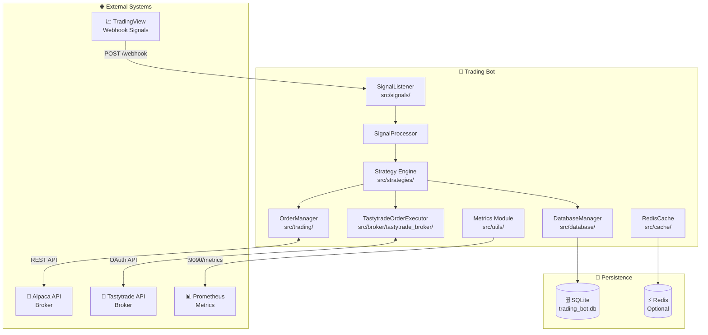

---

## 🎯 Adapter Summary

| # | Adapter | Purpose | Criticality | Failure Impact |
|:-:|:-------:|:--------|:-----------:|:---------------|
| 1 | 🦙 **Alpaca** | Trade execution, positions, market data | 🔴 **CRITICAL** | Cannot execute trades via Alpaca |
| 2 | 🍒 **Tastytrade** | Trade execution, positions (options-capable) | 🔴 **CRITICAL** | Cannot execute trades via Tastytrade |
| 3 | 🗄️ **SQLite** | Position & order persistence | 🔴 **CRITICAL** | System halt (no state) |
| 4 | 📈 **TradingView** | Inbound webhook signals | 🔴 **CRITICAL** | No signals received (passive mode) |
| 5 | 📊 **Prometheus** | Metrics exposition | 🟢 **LOW** | Observability loss only |
| 6 | ⚡ **Redis** | Response caching (optional) | 🟢 **LOW** | Performance degradation |

---

## 🦙 1. Alpaca API

> **Primary broker for US equity trading with real-time market data**

### 📐 Integration Flow

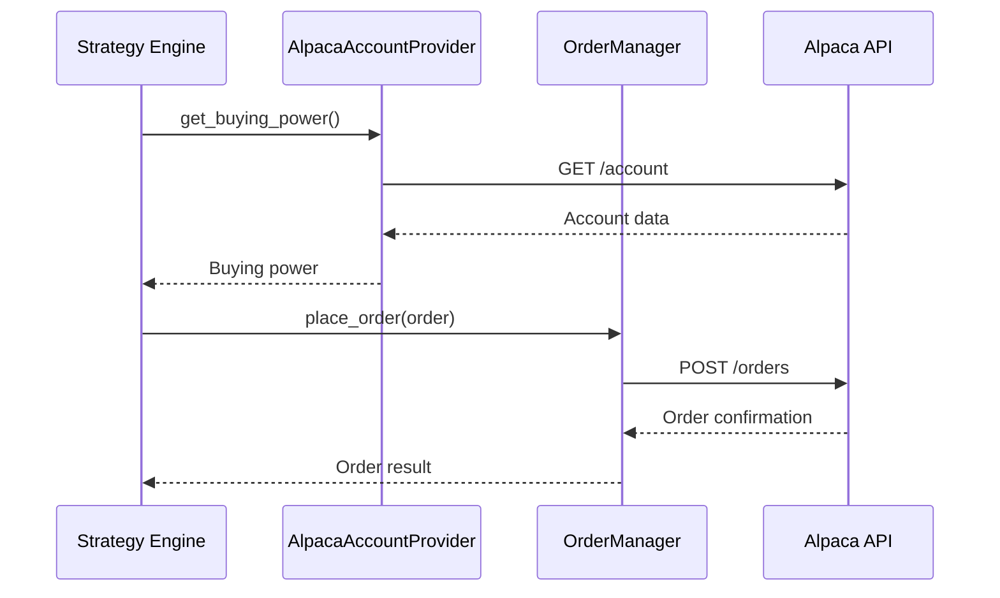

### 🔗 Integration Points

| Class | File | Key Methods |
|:------|:-----|:------------|
| `AlpacaAccountProvider` | `src/trading/alpaca_account_provider.py` | `get_account_value()`, `get_buying_power()`, `get_account()`, `sync_positions()` |
| `OrderManager` | `src/trading/order_manager.py` | `place_order()`, `cancel_order()`, `get_order()`, `monitor_fills()` |

### ⚙️ Configuration

```toml
# config/settings.toml
[default.api.alpaca]
base_url = "https://paper-api.alpaca.markets"
communication_method = "rest"

# config/.secrets.toml
[default.api.alpaca]
api_key = "PK******************"
secret_key = "***********************"
```

### 🛡️ Resilience

| Pattern | Implementation |
|:--------|:---------------|
| **Retry** | 3 attempts with configurable delay (`max_retries`, `retry_delay`) |
| **Circuit Breaker** | Via `src/resilience/circuit_breaker.py` |
| **Fallback** | None — critical path |

### 📦 Dependencies
- `alpaca-py` — Official REST/WebSocket client
- `httpx` — Async HTTP transport

---

## 🍒 2. Tastytrade API

> **Secondary broker with options trading capabilities using OAuth v11.x**

### 📐 Integration Flow

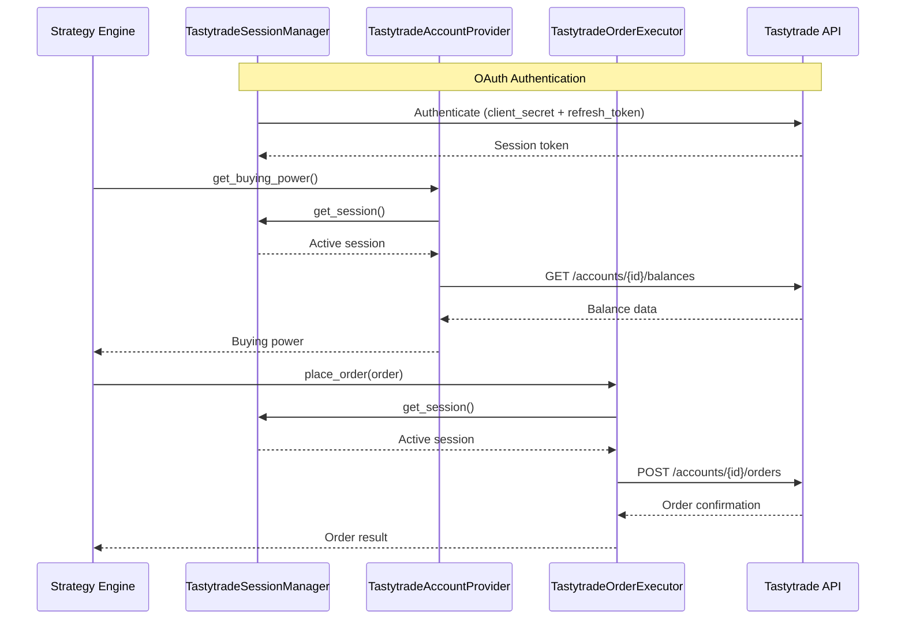

### 🔗 Integration Points

| Class | File | Key Methods |
|:------|:-----|:------------|
| `TastytradeSessionManager` | `src/broker/tastytrade_broker/session_manager.py` | `get_session()`, `refresh_session()`, `close_session()` |
| `TastytradeAccountProvider` | `src/broker/tastytrade_broker/account_provider.py` | `get_account_value()`, `get_buying_power()`, `get_positions()` |
| `TastytradeOrderExecutor` | `src/broker/tastytrade_broker/order_executor.py` | `place_order()`, `cancel_order()`, `get_order_status()` |
| `TastytradeMarketDataProvider` | `src/broker/tastytrade_broker/market_data_provider.py` | `get_current_price()`, `subscribe()`, `unsubscribe()` |
| `TastytradeAccountMixin` | `src/broker/tastytrade_broker/account_mixin.py` | `_get_account_object()`, `_clear_account_cache()` |

### ⚙️ Configuration

```toml
# config/settings.toml
[default.api.tastytrade]
is_sandbox = true

# config/.secrets.toml
[default.api.tastytrade]
client_secret = "your-oauth-client-secret"
refresh_token = "your-oauth-refresh-token"
account_id = "5************"
```

> ⚠️ **Note**: Tastytrade SDK v11.x uses **OAuth authentication** (`client_secret` + `refresh_token`), not username/password.

### 🛡️ Session Lifecycle

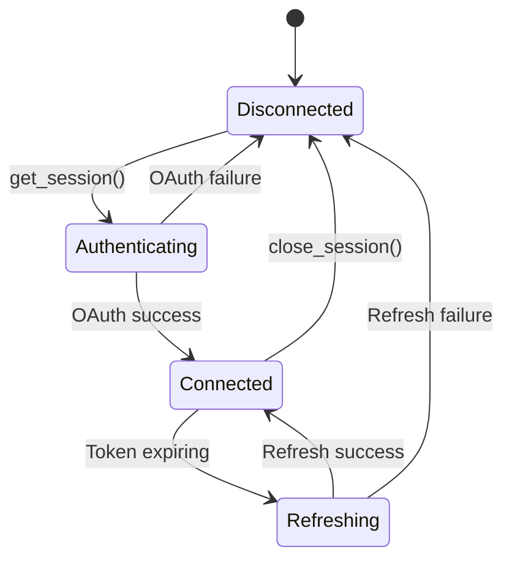

### 📦 Dependencies
- `tastytrade` — Official Python SDK (v11.x, OAuth-based)

---

## 🗄️ 3. SQLite Database

> **Persistent storage for positions, orders, trades, and DCA metadata**

### 📐 Data Model

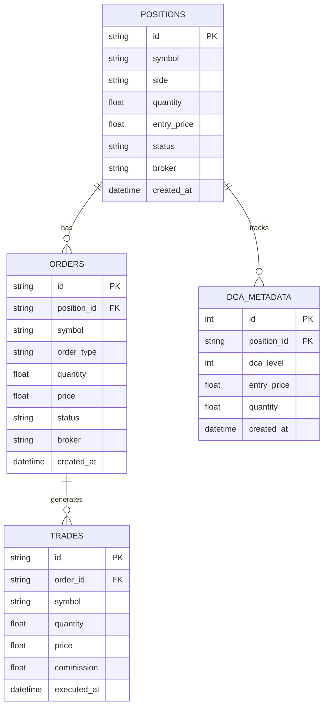

### 🔗 Integration Points

| Class | File | Key Methods |
|:------|:-----|:------------|
| `Base` | `src/database/base.py` | Shared SQLAlchemy declarative base |
| `DatabaseManager` | `src/database/database_manager.py` | `initialize()`, `save_position()`, `get_position()`, `get_all_positions()`, `save_order()`, `update_order_status()` |
| `DCAMetadataManager` | `src/database/dca_metadata_manager.py` | `save_dca_metadata()`, `get_dca_history()`, `get_average_entry()` |

### ⚙️ Configuration

```toml
# config/settings.toml
[default.database]
url = "sqlite:///trading_bot.db"
echo = false
pool_size = 5
max_overflow = 10
```

### 🛡️ Transaction Safety

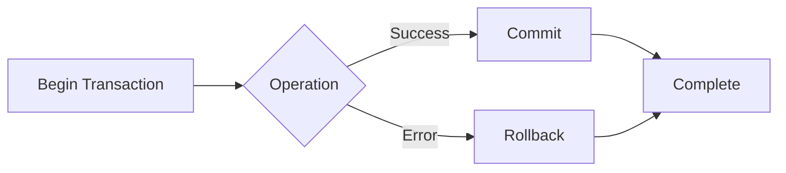

### 📦 Dependencies
- `SQLAlchemy` — Async ORM (≥2.0.36 for Python 3.13)
- `aiosqlite` — Async SQLite driver

---

## 📈 4. TradingView Webhooks

> **Inbound signal ingestion via HTTP webhooks**

### 📐 Signal Processing Flow

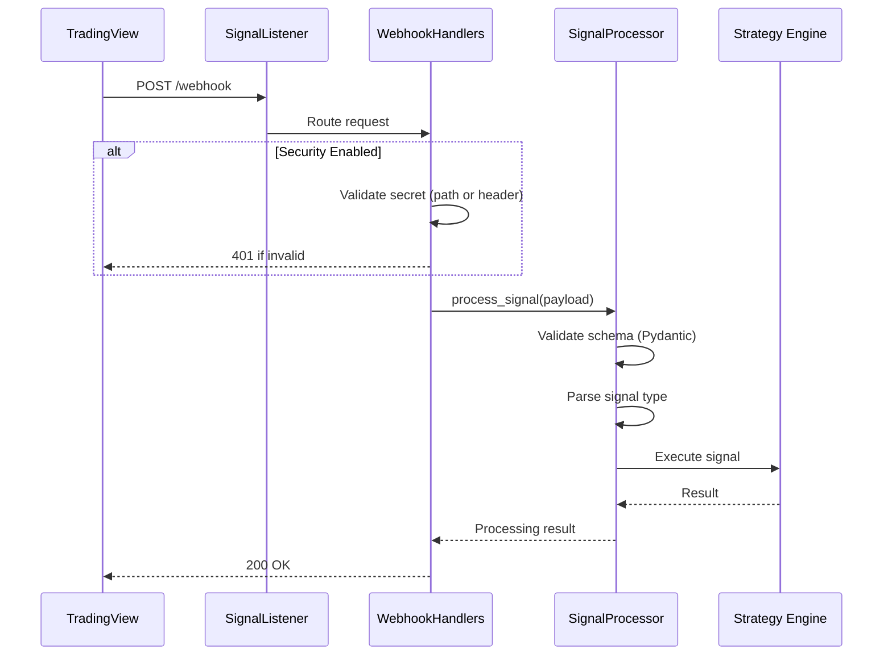

### 🔗 Integration Points

| Class | File | Key Methods |
|:------|:-----|:------------|
| `SignalListener` | `src/signals/signal_listener.py` | `start()`, `stop()`, `create_app()`, `setup_routes()` |
| `WebhookHandlers` | `src/signals/webhook_handlers.py` | `POST /webhook`, `POST /webhook/{secret}` |
| `SignalProcessor` | `src/signals/signal_processor.py` | `process_signal()`, `validate_signal()`, `parse_action()` |

### ⚙️ Configuration

```toml
# config/settings.toml
[default.api.webhook]
host = "0.0.0.0"
port = 8080
security_enabled = false

# config/.secrets.toml (if security enabled)
[default.api.webhook]
secret = "your-webhook-secret"
```

### 🛡️ Security Options

| Method | Implementation |
|:-------|:---------------|
| **Secret Header** | `X-Webhook-Secret` validation |
| **HMAC Signature** | `X-Signature` header verification |
| **Schema Validation** | Pydantic models for payload structure |

### 📦 Dependencies
- `fastapi` — Async web framework
- `uvicorn` — ASGI server

---

## 📊 5. Prometheus Metrics

> **Metrics exposition for monitoring and alerting**

### 📐 Metrics Architecture

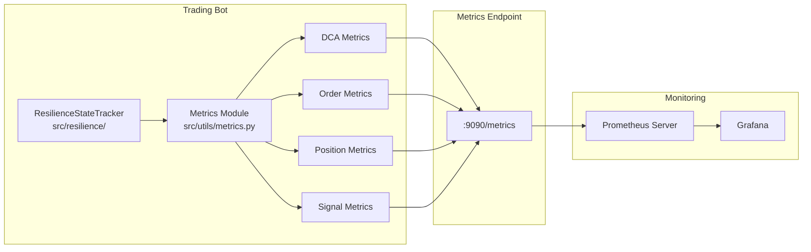

### 🔗 Integration Points

| Module/Class | File | Key Components |
|:------|:-----|:------------|
| `metrics` module | `src/utils/metrics.py` | Module-level Counters, Gauges, Histograms for all domains |
| `ResilienceStateTracker` | `src/resilience/resilience_state_tracker.py` | `update_metrics()`, state transitions |
| `SystemState` | `src/resilience/resilience_state_tracker.py` | `NORMAL`, `DEGRADED`, `CRITICAL`, `FAIL_CLOSED` |

### 📊 Metric Categories

| Category | Examples |
|:---------|:---------|
| **DCA** | `dca_levels_total`, `dca_investment_total` |
| **Orders** | `orders_placed_total`, `orders_filled_total`, `order_latency_seconds` |
| **Positions** | `active_positions`, `position_pnl` |
| **Signals** | `signals_received_total`, `signals_processed_total` |
| **Risk** | `risk_checks_passed`, `risk_checks_failed` |
| **System** | `system_state`, `uptime_seconds` |

### ⚙️ Configuration

```toml
# config/settings.toml
[default.monitoring]
enabled = true
metrics_port = 9090
health_check_interval = 30
position_monitoring_interval = 10
alpaca_sync_interval = 60
order_monitoring_interval = 5
```

### 📦 Dependencies
- `prometheus-client` — Python metrics library

---

## ⚡ 6. Redis Cache (Optional)

> **High-performance caching layer — graceful fallback if unavailable**

### 📐 Cache Flow

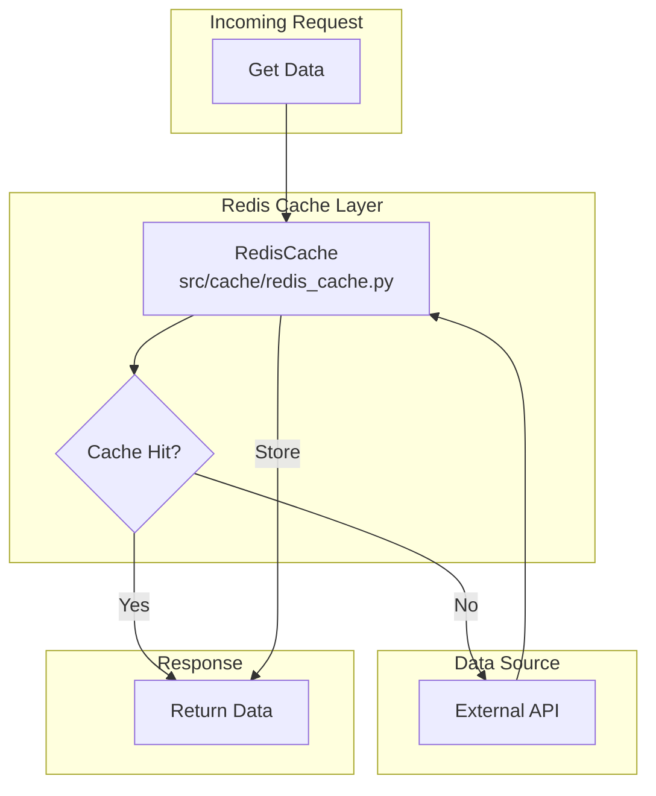

### 🔗 Integration Points

| Class | File | Key Methods |
|:------|:-----|:------------|
| `RedisCache` | `src/cache/redis_cache.py` | `get()`, `set()`, `delete()`, `exists()`, `expire()` |
| `CacheConfig` | `src/cache/redis_cache.py` | Configuration dataclass for cache settings |

### ⚙️ Configuration

> ℹ️ **Note**: Redis is **optional**. The `RedisCache` class gracefully handles missing `redis` dependency — caching is simply disabled if not installed.

### 📦 Dependencies
- `aioredis` — Async Redis client (optional, gracefully disabled if not installed)

---

## 🔄 Complete Integration Flow

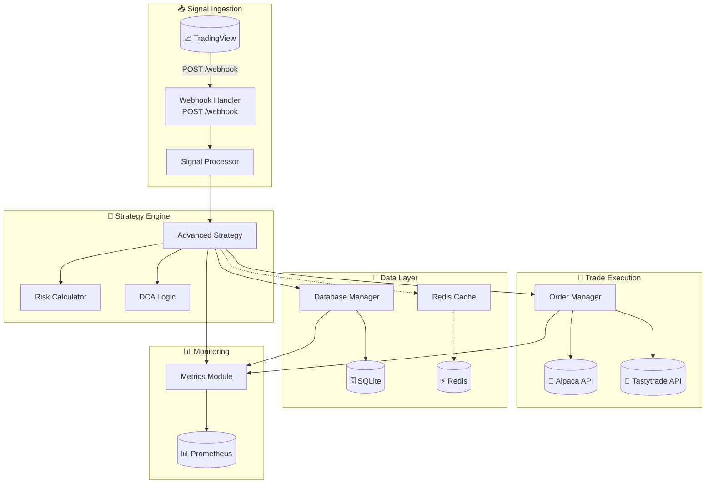

---

## 🛠️ Maintenance Procedures

### 📋 Planned Outage Sequence

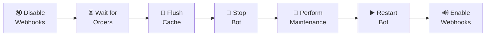

| Step | Action | Duration |
|:----:|:-------|:--------:|
| 1 | Disable TradingView alerts | ~1 min |
| 2 | Wait for active orders to settle | ~5 min |
| 3 | Flush Redis cache (if used) | ~1 min |
| 4 | `python shutdown_bot.py` | ~1 min |
| 5 | Perform maintenance | Variable |
| 6 | `python run_bot.py` + health check | ~2 min |
| 7 | Re-enable TradingView alerts | ~1 min |

### 🔄 Zero-Downtime Strategies

| Adapter | Strategy |
|:-------:|:---------|
| 🦙 Alpaca | Switch to paper account |
| 🍒 Tastytrade | Switch to sandbox mode |
| 🗄️ SQLite | Backup before migration |
| ⚡ Redis | Not required for core functionality |

---

## 🚨 Monitoring Checklist

| Adapter | Metric | Alert Threshold | Severity |
|:-------:|:-------|:---------------:|:--------:|
| 🦙 Alpaca | `alpaca_api_errors_total` | >5 in 5min | 🔴 High |
| 🍒 Tastytrade | `tastytrade_api_errors_total` | >5 in 5min | 🔴 High |
| 🗄️ SQLite | `db_connection_pool_exhausted` | >0 | 🔴 Critical |
| 📈 Webhook | `webhook_validation_failures_total` | >5 in 1min | 🟡 Medium |
| ⚡ Redis | `redis_connection_failures_total` | >20 in 10min | 🟡 Medium |

### 🏥 Health Endpoints

| Endpoint | Purpose |
|:---------|:--------|
| `GET /health` | Overall system health (via `monitoring_router.py`) |
| `GET /` | Root endpoint with service info |
| `GET :9090/metrics` | Prometheus metrics |

---

<div align="center">

| **Last Updated** | **Owner** | **Review Cadence** |
|:----------------:|:---------:|:------------------:|
| 2025-11-27 | Trading Bot Team | Quarterly |

</div>
