# ☁️ Azure Cloud Deployment Guide

<div align="center">

### *Production-Grade Cloud Hosting for Alpha-Trader*

[](https://azure.microsoft.com/)
[](https://azure.microsoft.com/en-us/products/container-apps)
[](https://azure.microsoft.com/en-us/products/cosmos-db)

---

*Deploy your trading bot to Azure with enterprise-grade reliability, real-time updates via SignalR, and a professional trading terminal.*

**Estimated Monthly Cost: ~$15/month** *(mostly free-tier services)*

</div>

---

## 📑 Table of Contents

- [🎯 Overview](#-overview)
- [🏗️ Architecture](#️-architecture)
- [💰 Cost Breakdown](#-cost-breakdown)
- [🔧 Prerequisites](#-prerequisites)
- [🚀 Deployment Guide](#-deployment-guide)
- [⚡ Real-Time Updates (SignalR)](#-real-time-updates-signalr)
- [🔄 Configuration Hot-Reload](#-configuration-hot-reload)
- [🔐 Security](#-security)
- [🛠️ CI/CD Pipeline](#️-cicd-pipeline)
- [📊 Monitoring](#-monitoring)
- [🔧 Troubleshooting](#-troubleshooting)

---

## 🎯 Overview

This guide migrates the trading bot from local ngrok-based hosting to Azure cloud deployment, replacing the unstable ngrok tunnel with a permanent Azure HTTPS endpoint.

### Why Azure?

| Challenge (Local) | Solution (Azure) |
|:------------------|:-----------------|
| 🔄 Ngrok URL changes | ✅ Permanent HTTPS endpoint |
| 💾 SQLite file-based | ✅ Cosmos DB managed NoSQL |
| 🔒 Manual secret management | ✅ Azure Key Vault |
| 📊 No monitoring | ✅ Azure Monitor + Alerts |
| 🚀 Manual deployment | ✅ GitHub Actions CI/CD |
| 📱 No management UI | ✅ Professional trading terminal |

### Migration Benefits

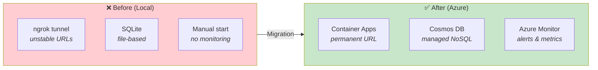

---

## 🏗️ Architecture

### High-Level Architecture

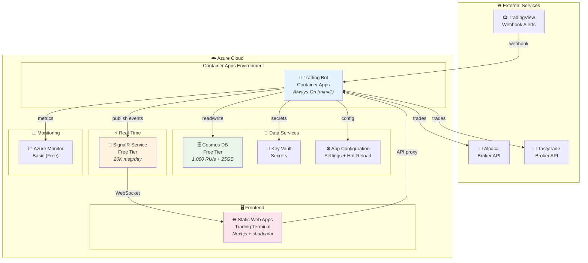

### Container Architecture

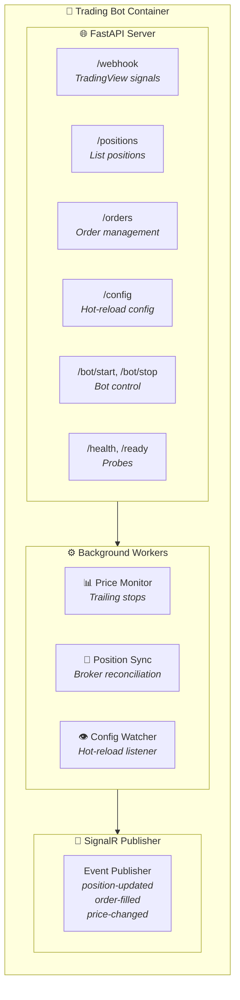

### Data Flow

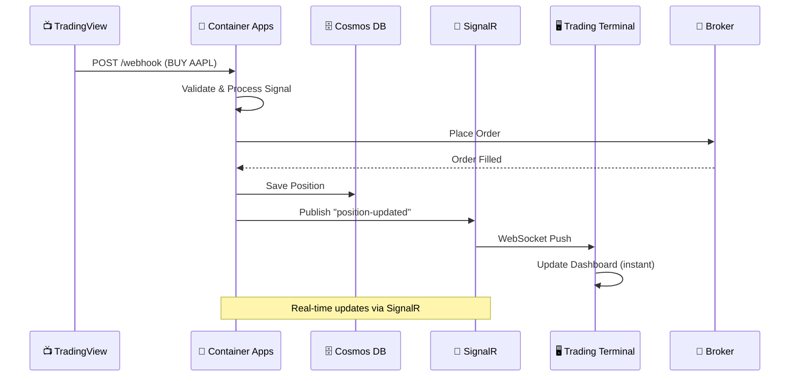

---

## 💰 Cost Breakdown

### Monthly Cost Estimate

| Service | Tier | Monthly Cost | Notes |
|:--------|:-----|:-------------|:------|
| **Container Apps** | Consumption (min=1) | ~$10 | Always-on for price monitoring |
| **Cosmos DB** | Free Tier | **$0** | 1,000 RU/s + 25GB (lifetime free) |
| **Static Web Apps** | Free Tier | **$0** | 100GB bandwidth |
| **SignalR Service** | Free Tier | **$0** | 20K messages/day, 20 connections |
| **Key Vault** | Standard | **$0** | 10K ops (12-month free) |
| **App Configuration** | Free Tier | **$0** | 1,000 requests/day |
| **Azure AD** | Free Tier | **$0** | Single admin user |
| **Azure Monitor** | Basic | **$0** | Free metrics + alerts |
| **Container Registry** | Basic | ~$5 | CI/CD image storage |
| **Total** | | **~$15/month** | |

### Free Tier Limits

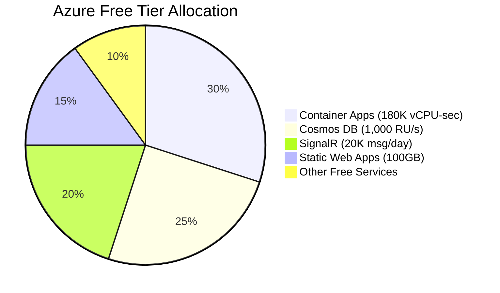

> 💡 **Tip**: Enable Cosmos DB Free Tier when creating the account—it cannot be enabled later.

---

## 🔧 Prerequisites

### Required Tools

| Tool | Version | Installation |
|:-----|:--------|:-------------|
| **Azure CLI** | 2.50+ | `winget install Microsoft.AzureCLI` |
| **Docker Desktop** | Latest | [Download](https://www.docker.com/products/docker-desktop/) |
| **Node.js** | 18+ | `winget install OpenJS.NodeJS.LTS` |
| **Bicep CLI** | Latest | Included with Azure CLI |

### Azure Account Setup

```powershell
# Login to Azure
az login

# Set subscription (if you have multiple)
az account set --subscription "<subscription-name-or-id>"

# Register required providers
az provider register --namespace Microsoft.App
az provider register --namespace Microsoft.ContainerRegistry
az provider register --namespace Microsoft.DocumentDB
az provider register --namespace Microsoft.SignalRService
az provider register --namespace Microsoft.Web
```

---

## 🚀 Deployment Guide

### Quick Deploy

```powershell
# Navigate to infrastructure directory
cd infra

# Deploy all resources (first time)
.\deploy.ps1 -Environment demo -Location eastus

# Deploy with custom resource group
.\deploy.ps1 -Environment demo -Location eastus -ResourceGroup my-trading-bot-rg
```

### Step-by-Step Deployment

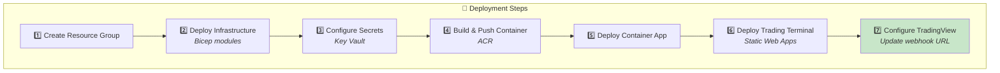

#### Step 1: Create Resource Group

```powershell
$resourceGroup = "rg-alpha-trader-demo"
$location = "eastus"

az group create --name $resourceGroup --location $location
```

#### Step 2: Deploy Infrastructure

```powershell
# Deploy all Azure resources using Bicep
az deployment group create `
    --resource-group $resourceGroup `
    --template-file infra/main.bicep `
    --parameters environment=demo `
    --parameters location=$location
```

#### Step 3: Configure Secrets

```powershell
# Get Key Vault name from deployment output
$keyVaultName = (az deployment group show `
    --resource-group $resourceGroup `
    --name main `
    --query properties.outputs.keyVaultName.value -o tsv)

# Add secrets
az keyvault secret set --vault-name $keyVaultName --name "alpaca-api-key" --value "<your-key>"
az keyvault secret set --vault-name $keyVaultName --name "alpaca-secret-key" --value "<your-secret>"
az keyvault secret set --vault-name $keyVaultName --name "webhook-secret" --value "<your-webhook-secret>"

# Optional: Tastytrade credentials
az keyvault secret set --vault-name $keyVaultName --name "tastytrade-username" --value "<username>"
az keyvault secret set --vault-name $keyVaultName --name "tastytrade-password" --value "<password>"
```

#### Step 4: Build & Push Container

```powershell
# Get ACR name
$acrName = (az deployment group show `
    --resource-group $resourceGroup `
    --name main `
    --query properties.outputs.containerRegistryName.value -o tsv)

# Login to ACR
az acr login --name $acrName

# Build and push
docker build -t $acrName.azurecr.io/trading-bot:latest .
docker push $acrName.azurecr.io/trading-bot:latest
```

#### Step 5: Deploy Container App

```powershell
# Update container app with new image
az containerapp update `
    --name ca-alpha-trader-demo `
    --resource-group $resourceGroup `
    --image $acrName.azurecr.io/trading-bot:latest
```

#### Step 6: Deploy Trading Terminal

```powershell
cd trading-terminal

# Build Next.js app
npm run build

# Deploy to Static Web Apps (via GitHub Actions or CLI)
az staticwebapp create `
    --name swa-alpha-trader-demo `
    --resource-group $resourceGroup `
    --source https://github.com/<your-repo> `
    --branch main `
    --app-location "trading-terminal" `
    --output-location ".next"
```

#### Step 7: Configure TradingView

Update your TradingView alerts to use the new Azure endpoint:

```
https://ca-alpha-trader-demo.<region>.azurecontainerapps.io/webhook/<your-secret>
```

---

## ⚡ Real-Time Updates (SignalR)

### Architecture

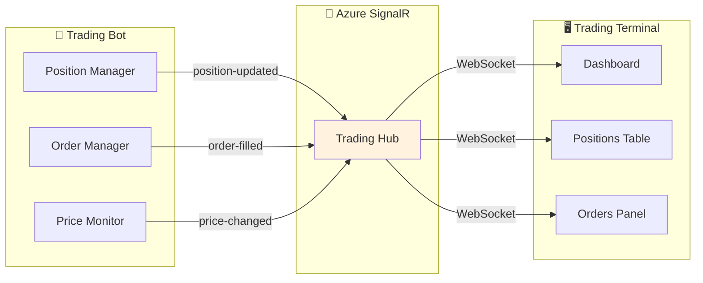

### SignalR Events

| Event | Trigger | Payload |
|:------|:--------|:--------|
| `position-updated` | Position change | `{ symbol, quantity, avgPrice, pnl }` |
| `order-filled` | Order execution | `{ orderId, symbol, side, filledPrice }` |
| `price-changed` | Market data update | `{ symbol, price, change }` |
| `bot-status` | Start/stop/error | `{ status, uptime, activePositions }` |
| `config-changed` | Hot-reload | `{ setting, oldValue, newValue }` |

### Client Integration

```typescript
// trading-terminal/lib/signalr.ts
import { HubConnectionBuilder } from '@microsoft/signalr';

const connection = new HubConnectionBuilder()
  .withUrl('/api/signalr')
  .withAutomaticReconnect()
  .build();

connection.on('position-updated', (position) => {
  // Update Zustand store
  usePositionStore.getState().updatePosition(position);
});

connection.on('order-filled', (order) => {
  // Show toast notification
  toast.success(`Order filled: ${order.symbol} @ $${order.filledPrice}`);
});
```

---

## 🔄 Configuration Hot-Reload

### How It Works

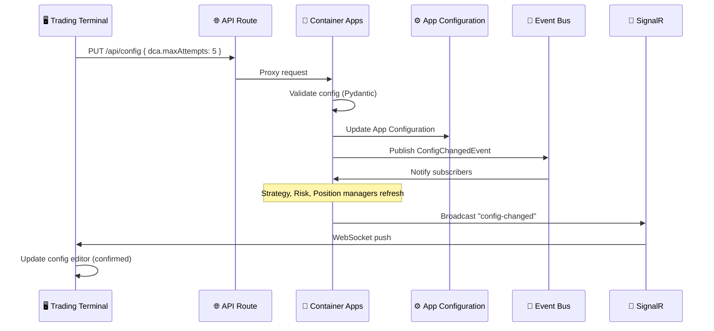

### Configurable Settings

| Category | Settings | Hot-Reload |
|:---------|:---------|:-----------|
| **DCA Strategy** | maxAttempts, dropPercent, progressiveMultiplier | ✅ Immediate |
| **Risk Limits** | maxPositionSize, dailyLossLimit, portfolioExposure | ✅ Immediate |
| **Trailing Stop** | activationPercent, trailPercent | ✅ Immediate |
| **Profit Taking** | targetPercent, partialExitPercent | ✅ Immediate |
| **Bot Control** | enabled, paperTrading | ✅ Immediate |

---

## 🔐 Security

### Security Architecture

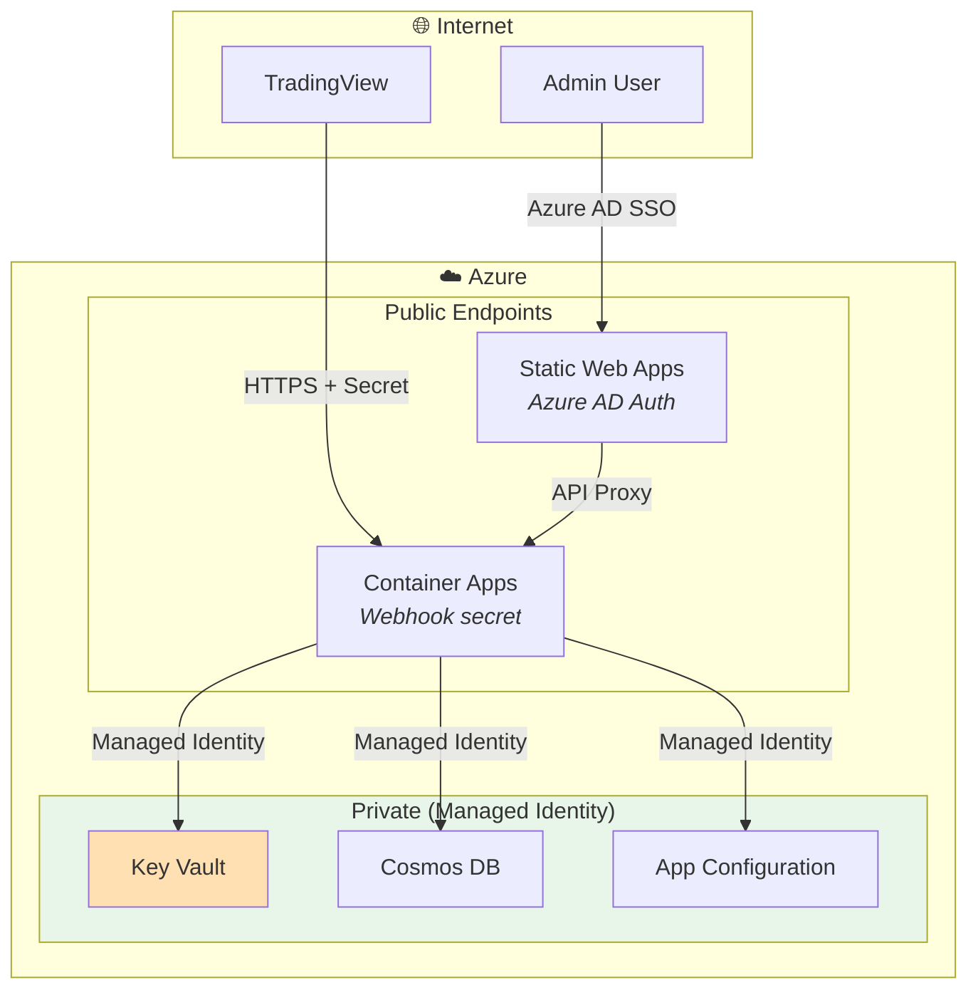

### Security Checklist

- [x] **HTTPS Only**: All endpoints enforce HTTPS
- [x] **Azure AD Authentication**: Trading terminal requires login
- [x] **Managed Identity**: No credentials in code/config
- [x] **Key Vault**: Secrets stored securely
- [x] **Webhook Secret**: TradingView signals authenticated
- [x] **Network Isolation**: Private endpoints for data services
- [x] **RBAC**: Least privilege access

### Secrets in Key Vault

| Secret Name | Description |
|:------------|:------------|
| `alpaca-api-key` | Alpaca API key |
| `alpaca-secret-key` | Alpaca secret key |
| `tastytrade-username` | Tastytrade username |
| `tastytrade-password` | Tastytrade password |
| `webhook-secret` | TradingView webhook authentication |

---

## 🛠️ CI/CD Pipeline

### GitHub Actions Workflows

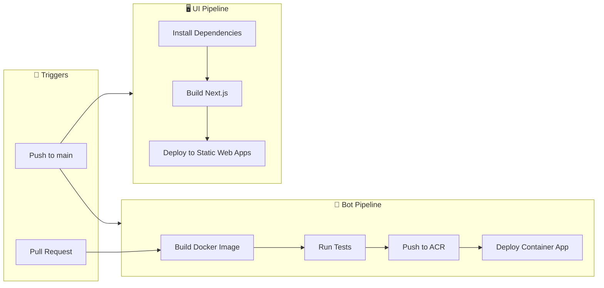

### Workflow Files

| File | Trigger | Actions |
|:-----|:--------|:--------|
| `.github/workflows/deploy-bot.yml` | Push to `main` | Build, test, push ACR, deploy |
| `.github/workflows/deploy-ui.yml` | Push to `main` | Build Next.js, deploy SWA |
| `.github/workflows/pr-check.yml` | Pull request | Build, test, lint |

---

## 📊 Monitoring

### Azure Monitor Dashboard

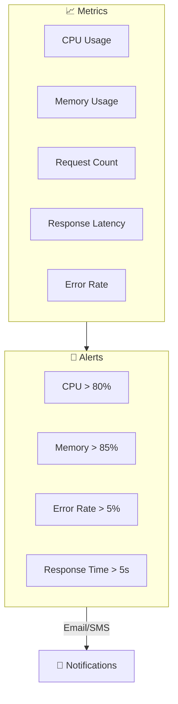

### Recommended Alerts

| Alert | Condition | Severity |
|:------|:----------|:---------|
| High CPU | CPU > 80% for 5 min | Warning |
| High Memory | Memory > 85% for 5 min | Warning |
| Error Spike | Error rate > 5% | Critical |
| Slow Response | P95 latency > 5s | Warning |
| Container Restart | Restart count > 3/hour | Critical |

---

## 🔧 Troubleshooting

### Common Issues

#### Container Won't Start

```powershell
# Check container logs
az containerapp logs show `
    --name ca-alpha-trader-demo `
    --resource-group rg-alpha-trader-demo `
    --follow

# Check revision status
az containerapp revision list `
    --name ca-alpha-trader-demo `
    --resource-group rg-alpha-trader-demo
```

#### SignalR Connection Issues

```powershell
# Check SignalR health
az signalr show `
    --name signalr-alpha-trader-demo `
    --resource-group rg-alpha-trader-demo `
    --query "hostName"

# Test connection
curl -I https://signalr-alpha-trader-demo.service.signalr.net/client/
```

#### Cosmos DB Throttling

```powershell
# Check RU consumption
az cosmosdb sql database throughput show `
    --account-name cosmos-alpha-trader-demo `
    --resource-group rg-alpha-trader-demo `
    --name trading-bot
```

### Health Check Endpoints

| Endpoint | Expected Response | Description |
|:---------|:------------------|:------------|
| `/health` | `200 OK` | Container is running |
| `/ready` | `200 OK` | All dependencies connected |
| `/status` | JSON with bot status | Detailed bot information |

---

## 📁 Infrastructure Files

```
infra/
├── main.bicep                    # Main orchestration
├── modules/
│   ├── container-apps.bicep      # Container Apps + Environment
│   ├── cosmos-db.bicep           # Cosmos DB account + containers
│   ├── signalr.bicep             # SignalR Service
│   ├── key-vault.bicep           # Key Vault + RBAC
│   ├── app-configuration.bicep   # App Configuration
│   ├── static-web-app.bicep      # Static Web Apps
│   ├── container-registry.bicep  # Azure Container Registry
│   └── monitoring.bicep          # Azure Monitor + Alerts
├── parameters/
│   ├── demo.bicepparam           # Demo environment parameters
│   └── live.bicepparam           # Live environment parameters
├── deploy.ps1                    # PowerShell deployment script
└── deploy.sh                     # Bash deployment script
```

---

<div align="center">

**Ready to deploy? Run `.\infra\deploy.ps1 -Environment demo`**

[](https://portal.azure.com)

</div>
