<div align="center">

# ⚙️ Configuration Guide

### *Complete Reference for Trading Bot Configuration*

[]()
[]()
[]()

---

*This guide covers the Trading Bot's layered configuration system using Dynaconf and TOML files.*  
*It explains environment switching, broker setup, symbol routing, and programmatic access.*

</div>

---

## 📑 Table of Contents

- [🚀 Quick Start](#-quick-start)
- [📁 Directory Structure](#-directory-structure)
- [🔄 Configuration Precedence](#-configuration-precedence)
- [🌍 Environment Switching](#-environment-switching)
- [🔐 Secrets Configuration](#-secrets-configuration)
- [🏦 Broker Configuration](#-broker-configuration)
- [🔀 Symbol Routing](#-symbol-routing)
- [📊 Risk Profiles](#-risk-profiles)
- [🖥️ CLI Commands](#️-cli-commands)
- [💻 Programmatic Access](#-programmatic-access)
- [🌐 Environment Variables](#-environment-variables)
- [🚨 Common Issues](#-common-issues)
- [📚 Key Configuration Sections](#-key-configuration-sections)

---

## 🚀 Quick Start

```bash
# 1️⃣ Initialize configuration
python -m src.config.cli init

# 2️⃣ Edit secrets file with your API credentials
# Edit: config/.secrets.toml

# 3️⃣ Validate configuration
python -m src.config.cli validate

# 4️⃣ Run the bot
python run_bot.py
```

---

## 📁 Directory Structure

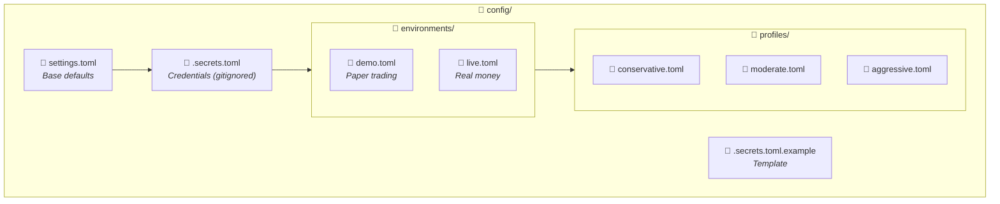

| File | Purpose | Committed to Git? |
|:-----|:--------|:-----------------:|
| `settings.toml` | All base defaults | ✅ Yes |
| `.secrets.toml` | API credentials | ❌ **No** |
| `.secrets.toml.example` | Template for secrets | ✅ Yes |
| `environments/*.toml` | Environment overrides | ✅ Yes |
| `profiles/*.toml` | Risk profile presets | ✅ Yes |

---

## 🔄 Configuration Precedence

Settings are loaded in layers, with later files overriding earlier ones:

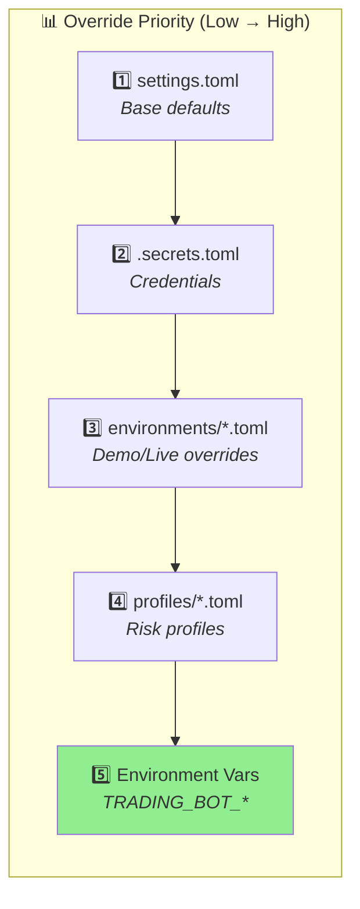

> 💡 **Tip**: Later sources override earlier ones. Environment variables have the highest priority.

---

## 🌍 Environment Switching

Switch between demo (paper) and live trading:

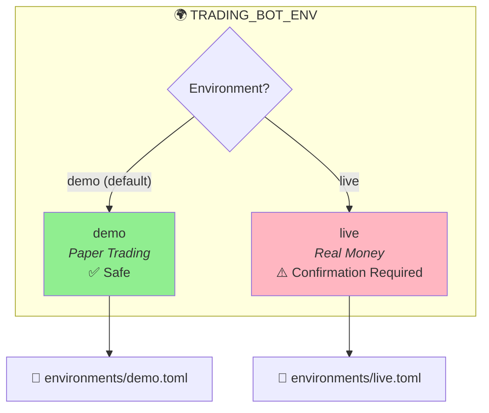

### 🖥️ Setting the Environment

```bash
# PowerShell
$env:TRADING_BOT_ENV = "demo"   # Paper trading (default)
$env:TRADING_BOT_ENV = "live"   # Real money ⚠️

# Bash/Zsh
export TRADING_BOT_ENV=demo
export TRADING_BOT_ENV=live

# Command Prompt
set TRADING_BOT_ENV=demo
set TRADING_BOT_ENV=live
```

> ⚠️ **Warning**: Live mode requires confirmation at startup to prevent accidental real-money trading.

---

## 🔐 Secrets Configuration

### 📝 Setup Steps

```bash
# Copy the template
cp config/.secrets.toml.example config/.secrets.toml

# Edit with your credentials
# (use your favorite editor)
```

> ⚠️ **Note**: The `.secrets.toml.example` template may contain legacy `username`/`password` fields for Tastytrade. The correct OAuth fields are shown below.

### 🏗️ Secrets File Structure

The secrets file uses **environment-scoped sections**:

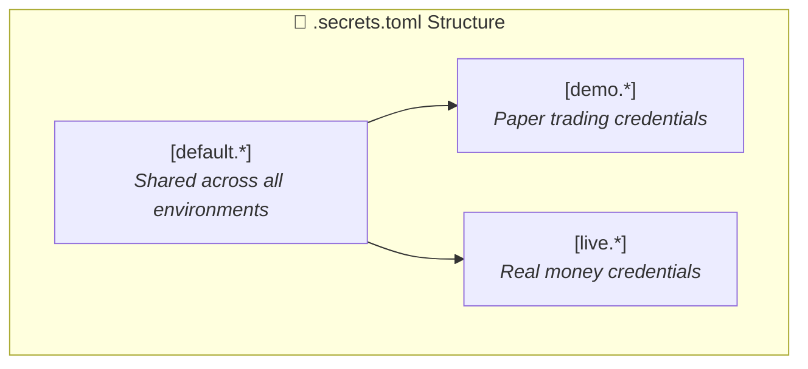

### 📄 Complete Secrets Template

```toml
# =============================================================================
# 🔐 Trading Bot Secrets Configuration
# =============================================================================
# NEVER commit this file to version control!
# Active environment set via: TRADING_BOT_ENV=demo|live
# =============================================================================

# -----------------------------------------------------------------------------
# 🌐 DEFAULT (Shared Settings)
# -----------------------------------------------------------------------------
# These apply to ALL environments unless overridden below.

[default.api.webhook]
secret = "your-webhook-secret"

[default.ngrok]
auth_token = "your-ngrok-token"

[default.monitoring.alerts.email]
smtp_server = ""
username = ""
password = ""
from_address = ""

[default.monitoring.alerts.slack]
webhook_url = ""

# -----------------------------------------------------------------------------
# 📊 DEMO (Paper Trading) Credentials
# -----------------------------------------------------------------------------
# Used when TRADING_BOT_ENV=demo (default)

[demo.api.alpaca]
api_key = "PKXXXXXXXXXXXXXXXX"        # Paper trading API key
secret_key = "XXXXXXXXXXXXXXXXXXXXXXXX"  # Paper trading secret

[demo.api.tastytrade]
client_secret = "your-oauth-client-secret"   # OAuth client secret
refresh_token = "your-oauth-refresh-token"   # OAuth refresh token
account_id = "5TXYYYYY"                      # Sandbox account ID

# -----------------------------------------------------------------------------
# 💰 LIVE (Real Money) Credentials
# -----------------------------------------------------------------------------
# Used when TRADING_BOT_ENV=live
# ⚠️ WARNING: These credentials trade with REAL MONEY!

[live.api.alpaca]
api_key = "AKXXXXXXXXXXXXXXXX"        # Live trading API key
secret_key = "XXXXXXXXXXXXXXXXXXXXXXXX"  # Live trading secret

[live.api.tastytrade]
client_secret = "your-live-oauth-client-secret"
refresh_token = "your-live-oauth-refresh-token"
account_id = "5XXXXXXX"  # Production account ID
```

> 🔒 **Security**: The `.secrets.toml` file is automatically gitignored. Never commit credentials!

---

## 🏦 Broker Configuration

### 🦙 Alpaca

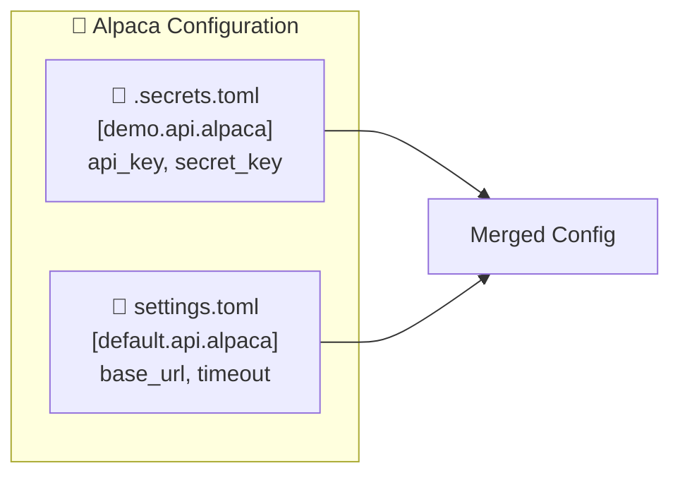

**Credentials** (in `.secrets.toml`):
```toml
[demo.api.alpaca]
api_key = "PKXXXXXXXXXXXXXXXX"
secret_key = "XXXXXXXXXXXXXXXXXXXXXXXX"
```

**Settings** (in `settings.toml`):
```toml
[default.api.alpaca]
base_url = "https://paper-api.alpaca.markets"  # Demo
# base_url = "https://api.alpaca.markets"      # Live
timeout = 30
max_retries = 3
```

---

### 🍒 Tastytrade (OAuth v11.x)

> ⚠️ **Important**: Tastytrade SDK v11.x uses **OAuth authentication**, not username/password.

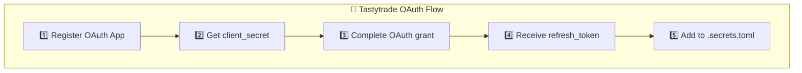

**Credentials** (in `.secrets.toml`):
```toml
[demo.api.tastytrade]
client_secret = "your-oauth-client-secret"   # From OAuth app setup
refresh_token = "your-oauth-refresh-token"   # Never expires
account_id = "5TXYYYYY"                      # Your account ID
```

**Settings** (in `settings.toml`):
```toml
[default.api.tastytrade]
is_sandbox = true   # true = Sandbox, false = Production
```

> 📚 **Reference**: See [Tastytrade API Sessions Documentation](https://tastyworks-api.readthedocs.io/en/latest/sessions.html) for OAuth setup.

---

### ✅ Broker Requirements

At least one broker must be **fully configured**:

| Broker | Required Fields |
|:-------|:----------------|
| 🦙 Alpaca | `api_key` + `secret_key` |
| 🍒 Tastytrade | `client_secret` + `refresh_token` + `account_id` |

> ⚠️ **Note**: Partial configuration (some fields filled) is treated as unconfigured.

---

## 🔀 Symbol Routing

The trading bot uses **two complementary routing systems** for different purposes:

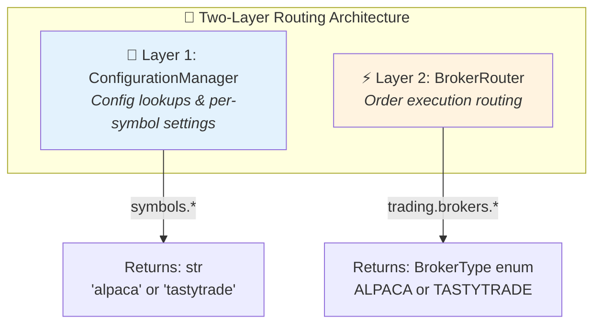

| Layer | Class | Config Keys | Returns | Purpose |
|:------|:------|:------------|:--------|:--------|
| 🔧 **Configuration** | `ConfigurationManager` | `symbols.*` | `str` | Config lookups, per-symbol settings |
| ⚡ **Execution** | `BrokerRouter` | `trading.brokers.*` | `BrokerType` | Actual order execution at runtime |

---

### 🔧 Layer 1: Configuration Manager Routing

Used for configuration lookups and per-symbol settings (position sizes, risk limits):

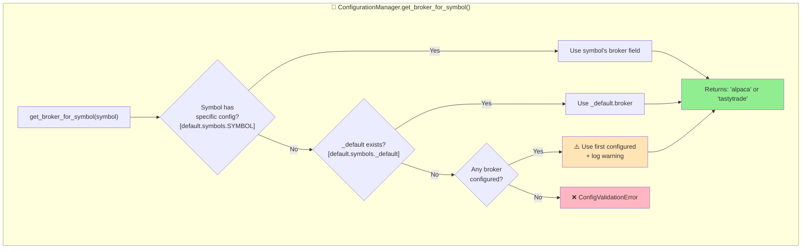

> 📝 **Note**: If no `symbols._default.broker` is set but brokers are configured, the code uses the first configured broker and logs a warning. Set `symbols._default.broker` to silence this warning.

**Configuration** (`config/settings.toml`):

```toml
# Default broker for all symbols (RECOMMENDED)
[default.symbols._default]
broker = "alpaca"

# Symbol-specific overrides (optional)
[default.symbols.SPY]
broker = "tastytrade"
max_position_size = 500
risk_per_trade = 0.015

[default.symbols.AAPL]
broker = "alpaca"
```

**Usage**:

```python
from src.config.settings import ConfigurationManager

config = ConfigurationManager()
broker_name = config.get_broker_for_symbol("SPY")  # Returns "tastytrade"
broker_name = config.get_broker_for_symbol("MSFT")  # Returns "alpaca" (from _default)
```

---

### ⚡ Layer 2: Broker Router (Execution)

Used at **order execution time** to route trades to the correct broker adapter.

> ⚠️ **Note**: The `trading.brokers.*` config sections are **not included** in the default `settings.toml`. Add them manually to enable explicit execution routing.

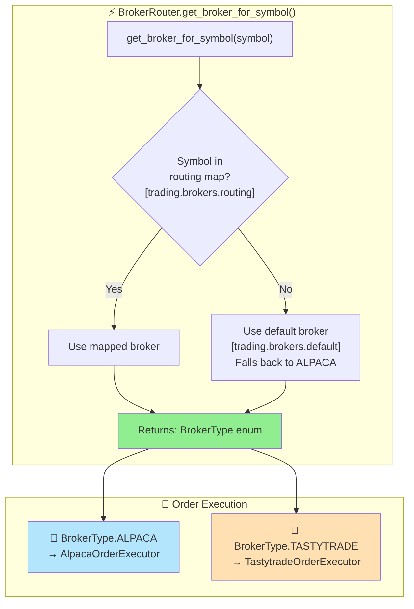

**Configuration** (add to `config/settings.toml`):

```toml
# ============================================================
# 🔀 BROKER ROUTER CONFIG (Add this section manually)
# ============================================================
# These sections are NOT included by default. Add them to
# enable explicit execution-time routing via BrokerRouter.

[default.trading.brokers]
default = "alpaca"

[default.trading.brokers.routing]
SPY = "tastytrade"
IWM = "tastytrade"
```

**Usage** (internal to order execution):

```python
from src.broker.router import BrokerRouter
from src.broker.interfaces import BrokerType

# BrokerRouter is created by BrokerSubsystem
broker_type = router.get_broker_for_symbol("SPY")  # Returns BrokerType.TASTYTRADE
executor = router.get_order_executor(broker_type)  # Returns TastytradeOrderExecutor
```

---

### 🔄 How Both Layers Work Together

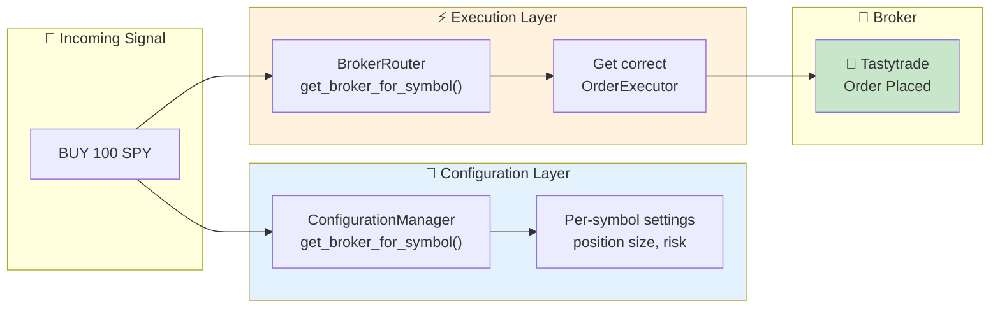

---

### 📋 Routing Configuration Summary

| Config Key | Used By | Returns | Purpose |
|:-----------|:--------|:--------|:--------|
| `symbols._default.broker` | `ConfigurationManager` | `str` | Default broker name for config |
| `symbols.{SYMBOL}.broker` | `ConfigurationManager` | `str` | Per-symbol broker name |
| `trading.brokers.default` | `BrokerRouter` | `BrokerType` | Default broker for execution |
| `trading.brokers.routing.{SYMBOL}` | `BrokerRouter` | `BrokerType` | Per-symbol execution routing |

> 💡 **Tip**: For most setups, configure both layers consistently. Set `symbols._default.broker` and `trading.brokers.default` to the same broker.

---

## 📊 Risk Profiles

Load pre-configured risk profiles to adjust trading parameters dynamically:

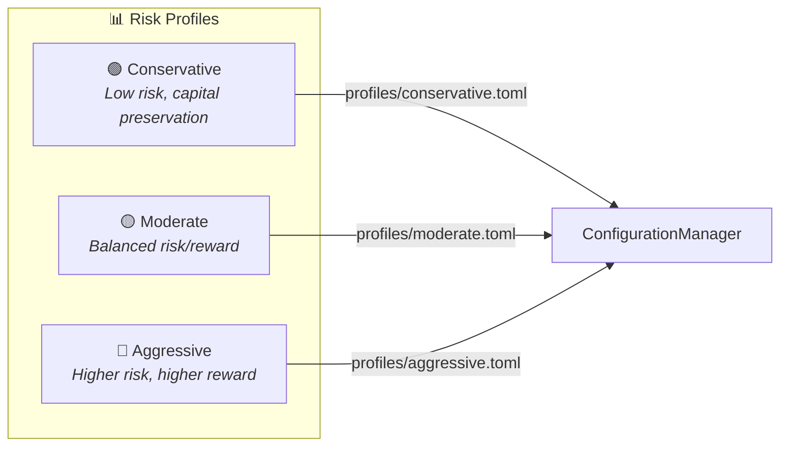

### 📈 Profile Comparison

*Values from actual `config/profiles/*.toml` files:*

| Setting | 🟢 Conservative | 🟡 Moderate | 🔴 Aggressive |
|:--------|:---------------:|:-----------:|:-------------:|
| **Position Sizing** ||||
| `initial_portfolio_percentage` | 0.5% | 1% | 2% |
| `risk_per_trade` | 1% | 2% | 3% |
| `max_single_position_percent` | 25% | 50% | 75% |
| `daily_loss_limit_percent` | 5% | 10% | 15% |
| `portfolio_drawdown_limit` | 10% | 15% | 25% |
| **DCA Strategy** ||||
| `base_threshold_percent` | 2.0% | 1.5% | 1.0% |
| `progressive_multiplier` | 2.0x | 1.8x | 1.5x |
| `max_threshold_percent` | 8.0% | 6.0% | 4.0% |
| **Averaging** ||||
| `multiplier` | 1.25x | 1.5x | 2.0x |
| `max_attempts` | 2 | 3 | 4 |
| **Risk Limits** ||||
| `max_positions` | 5 | 10 | 15 |

### 💻 Loading a Profile

```python
from src.config.settings import ConfigurationManager

config = ConfigurationManager()

# Load a risk profile - overrides current settings
config.load_profile("conservative")  # or "moderate" or "aggressive"

# Check current profile
print(f"Active profile: {config.current_profile}")  # Returns: "conservative"
```

> ⚠️ **Note**: Profile files must exist in `config/profiles/`. Valid profiles: `conservative`, `moderate`, `aggressive`.

---

## 🖥️ CLI Commands

### 📋 Command Overview

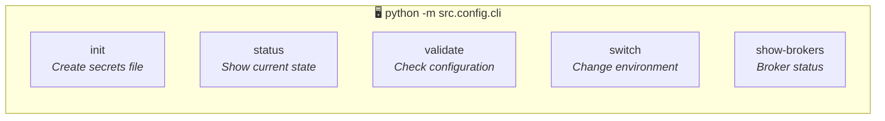

### 🔧 Command Details

| Command | Description | Usage |
|:--------|:------------|:------|
| `init` | Create secrets file from template | `python -m src.config.cli init` |
| `status` | Show environment, brokers, file status | `python -m src.config.cli status` |
| `validate` | Check all configuration is valid | `python -m src.config.cli validate` |
| `switch` | Show commands to switch environment | `python -m src.config.cli switch live` |
| `show-brokers` | Display broker configuration status | `python -m src.config.cli show-brokers` |

### ✅ Validation Checks

The `validate` command verifies:

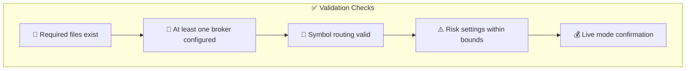

---

## 💻 Programmatic Access

### 🔑 Basic Usage

```python
from src.config.settings import ConfigurationManager, get_config

# Singleton access
config = ConfigurationManager()

# Get any config value with dot notation
order_type = config.get_config("trading.order_type")
risk = config.get_config("trading.position_sizing.risk_per_trade", 0.02)

# Convenience function
from src.config.settings import get_config
value = get_config("trading.order_type")
```

### 🏦 Broker Configuration Access

```python
# Alpaca configuration
alpaca = config.get_alpaca_config()
if alpaca.is_configured:
    print(f"Alpaca mode: {'paper' if alpaca.is_paper else 'live'}")

# Tastytrade configuration
tastytrade = config.get_tastytrade_config()
if tastytrade.is_configured:
    print(f"Tastytrade: {'sandbox' if tastytrade.is_sandbox else 'production'}")

# Get broker for a symbol
broker = config.get_broker_for_symbol("AAPL")  # Returns "alpaca" or "tastytrade"

# Get all configured brokers
brokers = config.get_configured_brokers()  # ["alpaca", "tastytrade"]
```

### ✅ Startup Validation

```python
from src.config.settings import validate_and_exit_on_error

# In bot startup - exits with code 1 if validation fails
config = validate_and_exit_on_error()
```

---

## 🌐 Environment Variables

Override any setting with environment variables using Dynaconf's pattern:

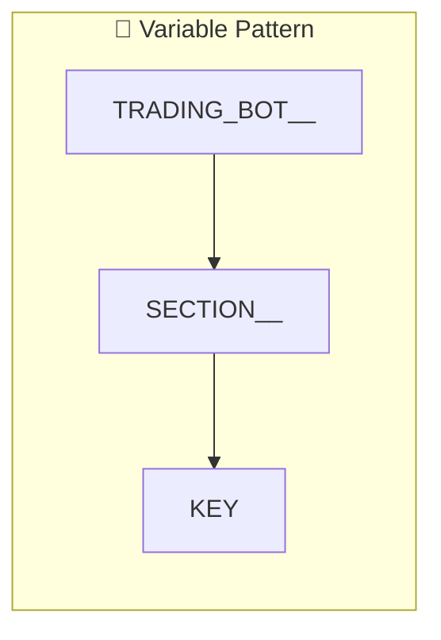

### 📋 Examples

```bash
# Pattern: TRADING_BOT__{SECTION}__{KEY}
# Note: Double underscores (__) for nesting

export TRADING_BOT__TRADING__ORDER_TYPE=market
export TRADING_BOT__LOGGING__LEVEL=DEBUG
export TRADING_BOT__MONITORING__ENABLED=false
```

> 💡 **Note**: Environment variables have the **highest priority** and override all file-based settings.

---

## 🚨 Common Issues

### ❌ "No brokers configured"

**Problem**: At least one broker must have all credentials filled.

**Solution**:
```toml
# Alpaca requires BOTH api_key AND secret_key
[demo.api.alpaca]
api_key = "your_key"
secret_key = "your_secret"

# Tastytrade requires ALL THREE fields
[demo.api.tastytrade]
client_secret = "your_client_secret"
refresh_token = "your_refresh_token"
account_id = "your_account_id"
```

---

### ❌ "Secrets file not found"

**Problem**: The `.secrets.toml` file doesn't exist.

**Solution**:
```bash
cp config/.secrets.toml.example config/.secrets.toml
```

---

### ❌ "Symbol broker not configured"

**Problem**: Routing a symbol to an unconfigured broker.

**Solution**: Ensure the target broker is configured:
```toml
[default.symbols.SPY]
broker = "tastytrade"  # ← Tastytrade must be configured!
```

---

### ❌ "Default symbol broker not configured"

**Problem**: The `_default` symbol routes to an unconfigured broker.

**Solution**:
```toml
[default.symbols._default]
broker = "alpaca"  # ← Alpaca must be configured!
```

---

## 🔄 Migration from config.yaml

If migrating from the old YAML configuration:

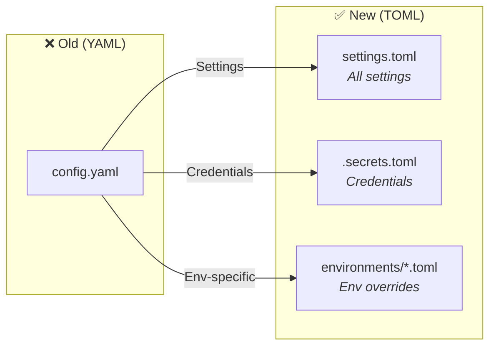

| Old Location | New Location |
|:-------------|:-------------|
| API credentials | `config/.secrets.toml` |
| Environment settings | `config/environments/*.toml` |
| All other settings | `config/settings.toml` |

---

## 📚 Key Configuration Sections

### 🔧 Trading Settings

```toml
[default.trading]
order_type = "limit"
limit_order_offset = 0.001
max_position_size = 1000
max_daily_trades = 50
risk_per_trade = 0.02

[default.trading.position_sizing]
method = "percentage"
initial_portfolio_percentage = 0.01
max_single_position_percent = 0.50
daily_loss_limit_percent = 0.10
```

### 📈 DCA Strategy

```toml
[default.strategies.dca]
base_threshold_percent = 1.5
progressive_multiplier = 1.8
max_threshold_percent = 6.0

[default.trading.position_sizing.averaging]
enabled = true
multiplier = 1.5
max_attempts = 3
```

### 🛡️ Risk Management

```toml
[default.trading.risk_management.stop_loss]
enabled = false
max_loss_percentage = 0.05

[default.trading.risk_management.profit_taking]
take_profit_percentage = 0.05

[default.trading.risk_management.profit_taking.trailing_profit]
enabled = true
activation_threshold = 0.03
trailing_percentage = 0.015
```

### 📊 Monitoring

```toml
[default.monitoring]
enabled = true
metrics_port = 9090
health_check_interval = 30
position_monitoring_interval = 10
```

---

<div align="center">

## 📋 Configuration Checklist

| Step | Action | Status |
|:----:|:-------|:------:|
| 1 | Copy `.secrets.toml.example` to `.secrets.toml` | ⬜ |
| 2 | Add Alpaca or Tastytrade credentials | ⬜ |
| 3 | Set `TRADING_BOT_ENV` (demo/live) | ⬜ |
| 4 | Configure symbol routing in `settings.toml` | ⬜ |
| 5 | Run `python -m src.config.cli validate` | ⬜ |
| 6 | Start bot with `python run_bot.py` | ⬜ |

---

| **Last Updated** | **Format** | **Config System** |
|:----------------:|:----------:|:-----------------:|
| November 2025 | TOML | Dynaconf |

</div>
