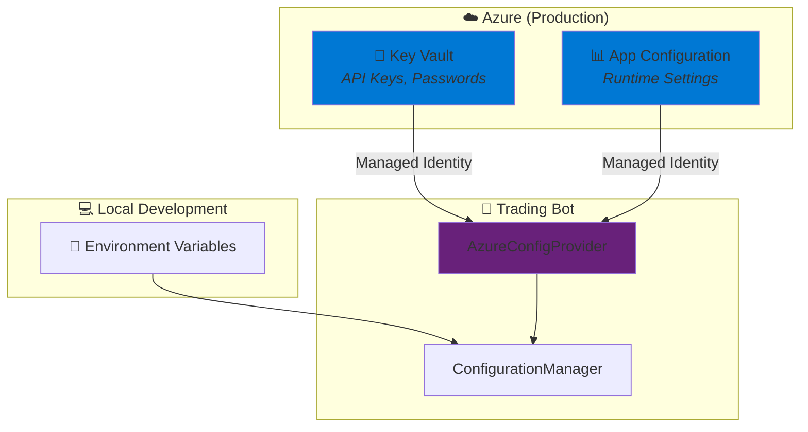

<div align="center">

# ⚙️ Configuration Guide

### *Azure-Native Configuration for Trading Bot*

[]()
[]()
[]()

---

*This guide covers the Trading Bot's Azure-native configuration system.*  
*Configuration is sourced from Azure Key Vault (secrets), Azure App Configuration (runtime settings),*
*with environment variable fallback for local development.*

</div>

---

## 📑 Table of Contents

- [🚀 Quick Start](#-quick-start)
- [🏗️ Architecture Overview](#️-architecture-overview)
- [🔐 Azure Key Vault (Secrets)](#-azure-key-vault-secrets)
- [📊 Azure App Configuration (Runtime Settings)](#-azure-app-configuration-runtime-settings)
- [🌍 Environment Variables (Local Development)](#-environment-variables-local-development)
- [🏦 Broker Configuration](#-broker-configuration)
- [💾 Database Configuration](#-database-configuration)
- [🔌 Webhook Configuration](#-webhook-configuration)
- [📝 Logging Configuration](#-logging-configuration)
- [🖥️ CLI Commands](#️-cli-commands)
- [💻 Programmatic Access](#-programmatic-access)
- [☁️ Azure Deployment](#️-azure-deployment)
- [🚨 Common Issues](#-common-issues)

---

## 🚀 Quick Start

### Local Development (Environment Variables)

```bash
# 1️⃣ Set required environment variables
export AZURE_COSMOS_ENDPOINT="https://your-cosmos-account.documents.azure.com:443/"
export AZURE_COSMOS_DATABASE="trading-bot"
export ALPACA_API_KEY="your-alpaca-api-key"
export ALPACA_SECRET_KEY="your-alpaca-secret-key"

# 2️⃣ Validate configuration
python -m src.config.cli validate

# 3️⃣ Run the bot
python run_bot.py
```

### Azure Deployment (Key Vault + App Configuration)

```bash
# 1️⃣ Set Azure endpoints
export AZURE_KEYVAULT_URL="https://your-keyvault.vault.azure.net/"
export AZURE_APP_CONFIGURATION_ENDPOINT="https://your-appconfig.azconfig.io"

# 2️⃣ Secrets are automatically loaded from Key Vault
# 3️⃣ Runtime config is loaded from App Configuration

# 4️⃣ Validate Azure connectivity
python -m src.config.cli check-azure

# 5️⃣ Run the bot
python run_bot.py
```

---

## 🏗️ Architecture Overview



### Configuration Priority

1. **Azure Key Vault** - Secrets (API keys, passwords, connection strings)
2. **Azure App Configuration** - Runtime settings (can be updated without redeployment)
3. **Environment Variables** - Local development fallback
4. **Defaults** - Built-in default values

---

## 🔐 Azure Key Vault (Secrets)

Store sensitive credentials in Azure Key Vault:

### Required Secrets

| Secret Name | Description | Example |
|:------------|:------------|:--------|
| `alpaca-api-key` | Alpaca API Key | `PKXXXXXX...` |
| `alpaca-secret-key` | Alpaca Secret Key | `xxxxxxxx...` |
| `webhook-secret` | Webhook validation secret | `your-secret-key` |

### Optional Secrets

| Secret Name | Description |
|:------------|:------------|
| `tastytrade-username` | Tastytrade account username |
| `tastytrade-password` | Tastytrade account password |
| `tastytrade-account-id` | Tastytrade account ID |
| `ngrok-auth-token` | Ngrok authentication token |

### Setting Up Key Vault

```bash
# Create Key Vault (if not exists)
az keyvault create --name your-keyvault --resource-group your-rg --location eastus

# Add secrets
az keyvault secret set --vault-name your-keyvault --name alpaca-api-key --value "YOUR_API_KEY"
az keyvault secret set --vault-name your-keyvault --name alpaca-secret-key --value "YOUR_SECRET"

# Grant access to your app's Managed Identity
az keyvault set-policy --name your-keyvault \
    --object-id <managed-identity-object-id> \
    --secret-permissions get list
```

---

## 📊 Azure App Configuration (Runtime Settings)

Runtime configuration that can be updated without redeployment:

### Configuration Keys

| Key | Description | Default |
|:----|:------------|:--------|
| `database/throughput_ru` | Cosmos DB throughput (RU/s) | `400` |
| `database/consistency_level` | Cosmos consistency level | `Session` |
| `logging/level` | Log level (DEBUG, INFO, WARNING, ERROR) | `INFO` |
| `logging/format` | Log format (json, text) | `json` |
| `webhook/port` | Webhook server port | `8080` |
| `webhook/host` | Webhook server host | `0.0.0.0` |
| `webhook/security_enabled` | Enable webhook security | `true` |
| `trading/order_type` | Default order type (limit, market) | `limit` |
| `trading/paper_mode` | Paper trading mode | `true` |
| `alpaca/base_url` | Alpaca API base URL | Paper trading URL |

### Hot-Reload Support

Configuration changes in Azure App Configuration are automatically reloaded:

```python
from src.config.azure_config_provider import AzureConfigProvider

provider = AzureConfigProvider()
await provider.initialize()

# Register change callback
def on_config_change(key: str, new_value: str):
    print(f"Config changed: {key} = {new_value}")

provider.on_change(on_config_change)

# Start background refresh (checks every 30 seconds)
await provider.start_refresh_task()
```

---

## 🌍 Environment Variables (Local Development)

For local development without Azure:

### Required Variables

```bash
# Azure Cosmos DB (Database)
export AZURE_COSMOS_ENDPOINT="https://your-account.documents.azure.com:443/"
export AZURE_COSMOS_DATABASE="trading-bot"

# Alpaca (choose one mode)
# Paper Trading
export ALPACA_API_KEY="your-paper-api-key"
export ALPACA_SECRET_KEY="your-paper-secret-key"
export ALPACA_BASE_URL="https://paper-api.alpaca.markets"

# Live Trading
export ALPACA_API_KEY="your-live-api-key"
export ALPACA_SECRET_KEY="your-live-secret-key"
export ALPACA_BASE_URL="https://api.alpaca.markets"
```

### Optional Variables

```bash
# Logging
export LOG_LEVEL="INFO"
export LOG_FORMAT="json"

# Webhook
export WEBHOOK_PORT="8080"
export WEBHOOK_HOST="0.0.0.0"
export WEBHOOK_SECRET="your-webhook-secret"

# Environment
export ENVIRONMENT="demo"  # or "live"

# Tastytrade (optional)
export TASTYTRADE_USERNAME="your-username"
export TASTYTRADE_PASSWORD="your-password"
export TASTYTRADE_ACCOUNT_ID="your-account-id"
```

### Environment Variable Mapping

| Environment Variable | Maps To | Priority |
|:--------------------|:--------|:---------|
| `AZURE_COSMOS_ENDPOINT` | `azure.cosmos.endpoint` | Required |
| `AZURE_COSMOS_DATABASE` | `azure.cosmos.database_name` | Env > Default |
| `ALPACA_API_KEY` | Secret: `alpaca-api-key` | Env > Key Vault |
| `ALPACA_SECRET_KEY` | Secret: `alpaca-secret-key` | Env > Key Vault |
| `LOG_LEVEL` | `logging.level` | Env > App Config |
| `WEBHOOK_PORT` | `webhook.port` | Env > App Config |

---

## 🏦 Broker Configuration

### Alpaca

```python
from src.core import ConfigurationManager

config = ConfigurationManager()
alpaca = config.get_alpaca_config()

print(f"API Key: {alpaca.api_key}")
print(f"Is Paper: {alpaca.is_paper}")
print(f"Is Configured: {alpaca.is_configured}")
```

Environment variables:
- `ALPACA_API_KEY` - Your Alpaca API key
- `ALPACA_SECRET_KEY` - Your Alpaca secret key
- `ALPACA_BASE_URL` - API base URL (determines paper vs live)

### Tastytrade

```python
config = ConfigurationManager()
tastytrade = config.get_tastytrade_config()

print(f"Username: {tastytrade.username}")
print(f"Is Sandbox: {tastytrade.is_sandbox}")
print(f"Is Configured: {tastytrade.is_configured}")
```

Environment variables:
- `TASTYTRADE_USERNAME` - Account username
- `TASTYTRADE_PASSWORD` - Account password
- `TASTYTRADE_ACCOUNT_ID` - Trading account ID
- `TASTYTRADE_IS_SANDBOX` - Set to "true" for sandbox mode

---

## 💾 Database Configuration (Cosmos DB)

The trading bot uses **Azure Cosmos DB** exclusively for all data persistence.

```python
config = ConfigurationManager()

# Cosmos DB is configured via Azure endpoints
cosmos_endpoint = config.get_config("azure.cosmos.endpoint")
cosmos_database = config.get_config("azure.cosmos.database_name", "trading-bot")
```

### Required Configuration

| Environment Variable | Description | Example |
|:--------------------|:------------|:--------|
| `AZURE_COSMOS_ENDPOINT` | Cosmos DB account endpoint | `https://account.documents.azure.com:443/` |
| `AZURE_COSMOS_DATABASE` | Database name | `trading-bot` |

### Cosmos DB Containers

The database uses the following containers:

| Container | Partition Key | Purpose |
|:----------|:-------------|:--------|
| `positions` | `/symbol` | Active trading positions |
| `orders` | `/symbol` | Order history |
| `trades` | `/symbol` | Completed trades with P&L |
| `signals` | `/symbol` | Trading signals received |
| `bots` | `/user_id` | Active bot configurations |
| `bot_orders` | `/bot_id` | Orders associated with bots |
| `bot_history` | `/user_id` | Closed bot records |

### Authentication

Cosmos DB uses **Azure Managed Identity** for authentication:
- **Local Development**: Uses Azure CLI credentials (`az login`)
- **Azure Deployment**: Uses system-assigned Managed Identity

### Setting Up Cosmos DB

```bash
# Create Cosmos DB account (if not exists)
az cosmosdb create \
    --name your-cosmos-account \
    --resource-group your-rg \
    --default-consistency-level Session

# Create database
az cosmosdb sql database create \
    --account-name your-cosmos-account \
    --resource-group your-rg \
    --name trading-bot

# Grant Managed Identity access (for Azure deployment)
az cosmosdb sql role assignment create \
    --account-name your-cosmos-account \
    --resource-group your-rg \
    --scope "/" \
    --principal-id <managed-identity-object-id> \
    --role-definition-id 00000000-0000-0000-0000-000000000002  # Cosmos DB Built-in Data Contributor
```

---

## 🔌 Webhook Configuration

```python
config = ConfigurationManager()
webhook = config.get_webhook_config()

print(f"Port: {webhook.port}")
print(f"Host: {webhook.host}")
print(f"Security Enabled: {webhook.security_enabled}")
```

Environment variables:
- `WEBHOOK_PORT` - Server port (default: 8080)
- `WEBHOOK_HOST` - Server host (default: 0.0.0.0)
- `WEBHOOK_SECRET` - HMAC validation secret
- `WEBHOOK_SECURITY_ENABLED` - Enable/disable security (default: true)

---

## 📝 Logging Configuration

```python
config = ConfigurationManager()
logging = config.get_logging_config()

print(f"Level: {logging.level}")
print(f"Format: {logging.format}")
```

Environment variables:
- `LOG_LEVEL` - DEBUG, INFO, WARNING, ERROR, CRITICAL (default: INFO)
- `LOG_FORMAT` - json or text (default: json)

---

## 🖥️ CLI Commands

### Check Status

```bash
python -m src.config.cli status
```

Output:
```
============================================================
Trading Bot Configuration Status
============================================================

📌 Environment: DEMO
   Set ENVIRONMENT to change (demo|live)

📁 Configuration Source:
   ○ Environment Variables (local development)

💾 Database:
   ✓ Configured: Azure Cosmos DB
   Endpoint: https://your-account.documents.azure.com:443/

📝 Logging:
   Level: INFO
   Format: json

🏦 Brokers:
   ✓ alpaca
   Default broker: alpaca
```

### Validate Configuration

```bash
python -m src.config.cli validate
```

### Show Broker Configuration

```bash
python -m src.config.cli show-brokers
```

### Check Azure Connectivity

```bash
python -m src.config.cli check-azure
```

### Switch Environment

```bash
python -m src.config.cli switch live
```

---

## 💻 Programmatic Access

### Synchronous Access (Recommended)

```python
from src.core import ConfigurationManager

# Get singleton instance
config = ConfigurationManager()

# Get simple config values
throughput = config.get_config("database.throughput_ru", 400)  # Cosmos RU/s
log_level = config.get_config("logging.level", "INFO")

# Get secrets
api_key = config.get_secret("alpaca-api-key", "")

# Get typed configurations
alpaca = config.get_alpaca_config()
db = config.get_database_config()  # Returns Cosmos DB config
webhook = config.get_webhook_config()
logging = config.get_logging_config()

# Check deployment type
if config.is_azure_deployment():
    print("Running in Azure")
else:
    print("Running locally")
```

### Async Access (Azure-Native)

```python
import asyncio
from src.config.azure_config_provider import AzureConfigProvider

async def main():
    provider = AzureConfigProvider()
    await provider.initialize()
    
    # Get from Key Vault
    api_key = await provider.get_secret("alpaca-api-key")
    
    # Get from App Configuration
    log_level = await provider.get_config("logging/level")
    
    # Get typed configuration
    alpaca = await provider.get_alpaca_broker_config()
    db = await provider.get_database_config()

asyncio.run(main())
```

---

## ☁️ Azure Deployment

### App Service Configuration

Set these Application Settings in Azure Portal:

```
AZURE_KEYVAULT_URL=https://your-keyvault.vault.azure.net/
AZURE_APP_CONFIGURATION_ENDPOINT=https://your-appconfig.azconfig.io
ENVIRONMENT=live
```

### Managed Identity Setup

1. **Enable System-Assigned Managed Identity** on your App Service
2. **Grant Key Vault Access**:
   ```bash
   az keyvault set-policy --name your-keyvault \
       --object-id <app-service-identity-id> \
       --secret-permissions get list
   ```
3. **Grant App Configuration Access**:
   ```bash
   az role assignment create \
       --role "App Configuration Data Reader" \
       --assignee <app-service-identity-id> \
       --scope /subscriptions/.../resourceGroups/.../providers/Microsoft.AppConfiguration/configurationStores/your-appconfig
   ```

### Container Apps Configuration

```yaml
# In your container app definition
properties:
  configuration:
    secrets:
      - name: keyvault-url
        value: "https://your-keyvault.vault.azure.net/"
    ingress:
      external: true
      targetPort: 8080
  template:
    containers:
      - name: trading-bot
        env:
          - name: AZURE_KEYVAULT_URL
            secretRef: keyvault-url
          - name: AZURE_APP_CONFIGURATION_ENDPOINT
            value: "https://your-appconfig.azconfig.io"
```

---

## 🚨 Common Issues

### Issue: "No credentials available for authentication"

**Cause**: Azure SDK cannot find valid credentials.

**Solution**:
1. For local development: Run `az login` 
2. For Azure: Ensure Managed Identity is enabled and has proper permissions

### Issue: "Configuration not loading from Azure"

**Cause**: Missing environment variables for Azure endpoints.

**Solution**:
```bash
export AZURE_KEYVAULT_URL="https://your-keyvault.vault.azure.net/"
export AZURE_APP_CONFIGURATION_ENDPOINT="https://your-appconfig.azconfig.io"
```

### Issue: "Broker not configured"

**Cause**: Required credentials not set.

**Solution**:
```bash
# For Alpaca
export ALPACA_API_KEY="your-api-key"
export ALPACA_SECRET_KEY="your-secret-key"

# Or add to Azure Key Vault
az keyvault secret set --vault-name your-kv --name alpaca-api-key --value "your-key"
az keyvault secret set --vault-name your-kv --name alpaca-secret-key --value "your-secret"
```

### Issue: "Permission denied accessing Key Vault"

**Cause**: Managed Identity lacks permissions.

**Solution**:
```bash
az keyvault set-policy --name your-keyvault \
    --object-id <identity-object-id> \
    --secret-permissions get list
```

---

<div align="center">

*For more information, see the main [README.md](../README.md)*

</div>
